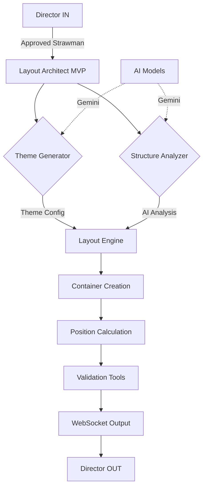
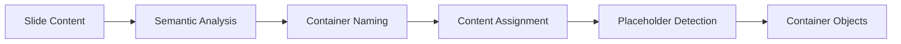

# Layout Architect Architecture Documentation

## Overview

The Layout Architect is a Phase 2 component of the Deckster system that transforms approved presentation strawman content into professional, visually-balanced slide layouts. It operates between the Director IN (Phase 1) and Director OUT (Phase 2), using AI-powered analysis to create optimal container arrangements and theme-consistent designs.

## Core Responsibilities

1. **Theme Generation** - Creates cohesive visual themes based on presentation context
2. **Structure Analysis** - Uses AI to determine optimal content arrangement
3. **Container Positioning** - Places content on a 160×90 integer grid system
4. **White Space Management** - Ensures 30-50% white space for visual balance
5. **WebSocket Protocol Compliance** - Outputs Phase 2 compatible layout data

## Architecture Flow



## Component Details

### 1. Theme Generator

**Purpose**: Analyzes presentation context to generate appropriate visual themes.

**Process**:
1. Extracts context from strawman (title, audience, duration, purpose)
2. Uses Gemini AI to generate theme based on:
   - Target audience formality
   - Industry conventions
   - Presentation purpose
   - Design suggestions from strawman
3. Creates theme configuration with:
   - Color palette (primary, secondary, background, text, accent)
   - Typography hierarchy (h1, h2, h3, body, caption)
   - Layout definitions for slide types

**Example Theme Generation**:
```python
# Input context
{
    "title": "Q3 Financial Results",
    "audience": "Board of Directors",
    "duration": 15,
    "overall_theme": "Data-driven and transparent"
}

# AI generates
{
    "theme_name": "professional",
    "colors": {
        "primary": "#0066cc",
        "secondary": "#4d94ff",
        "background": "#ffffff",
        "text": "#333333"
    },
    "typography": {
        "h1": {"fontSize": 48, "fontFamily": "Inter"},
        "h2": {"fontSize": 36, "fontFamily": "Inter"}
    }
}
```

### 2. Structure Analyzer (AI-Enhanced)

**Purpose**: Intelligently analyzes slide content to determine optimal structure.

**Process**:
1. Receives slide content and structure preference hint
2. AI analyzes:
   - Content type and density
   - Logical groupings
   - Visual balance requirements
   - Relationship between elements
3. Returns structured analysis with:
   - Recommended arrangement (vertical/horizontal/grid)
   - Container breakdown with element types
   - Content relationships
   - Visual balance score

**AI Analysis Example**:
```python
# Slide: "Three Key Benefits"
AI Analysis:
- Arrangement: GRID (3 equal items)
- Container Count: 4 (title + 3 benefits)
- Container Breakdown:
  - title: [h1: "Three Key Benefits"]
  - benefit_1: [h3: "Efficiency", text: "Description..."]
  - benefit_2: [h3: "Cost Savings", text: "Description..."]
  - benefit_3: [h3: "Scalability", text: "Description..."]
- Visual Balance: 0.85
- Relationships: ["parallel", "equal-importance"]
```

### 3. Layout Engine

**Purpose**: Core engine that orchestrates the layout creation process.

**Container Creation Flow**:


**Position Calculation Process**:

1. **Work Area Definition**:
   - Total grid: 160×90 units
   - Margins: 8 units on all sides
   - Work area: 144×74 units

2. **Arrangement Strategies**:

   **Vertical Layout**:
   ```
   ┌─────────────────────┐
   │      Title          │  8 GU margin
   ├─────────────────────┤
   │                     │
   │     Content 1       │  4 GU gutter
   │                     │
   ├─────────────────────┤
   │                     │
   │     Content 2       │
   │                     │
   └─────────────────────┘
   ```

   **Horizontal Layout**:
   ```
   ┌─────────────────────┐
   │      Title          │
   ├──────────┬──────────┤
   │          │          │
   │  Left    │  Right   │
   │  Content │  Content │
   │          │          │
   └──────────┴──────────┘
   ```

   **Grid Layout (2×2)**:
   ```
   ┌─────────────────────┐
   │      Title          │
   ├──────────┬──────────┤
   │  Cell 1  │  Cell 2  │
   ├──────────┼──────────┤
   │  Cell 3  │  Cell 4  │
   └──────────┴──────────┘
   ```

### 4. Grid Calculator

**Purpose**: Ensures all positions use integer values on the 160×90 grid.

**Key Functions**:
- `align_to_grid()`: Rounds positions to nearest integer
- `validate_position()`: Ensures positions fit within grid bounds
- `calculate_available_space()`: Determines work area after margins
- `center_content()`: Centers containers within areas

**Grid System**:
```
Total Grid: 160×90 units
1 Grid Unit (GU) = 1/160 of width or 1/90 of height

Example conversions:
- 50% width = 80 GU
- 25% height = 22.5 GU → rounds to 23 GU
- 8 GU margin = 5% of total width
```

### 5. White Space Calculator

**Purpose**: Validates layouts meet the 30-50% white space requirement.

**Calculation Method**:
1. Calculate total slide area: 160 × 90 = 14,400 GU²
2. Sum all container areas
3. White space = (total - containers) / total
4. Validate: 0.3 ≤ ratio ≤ 0.5

**Example**:
```python
# Title: 144×12 = 1,728 GU²
# Content: 144×58 = 8,352 GU²
# Total containers: 10,080 GU²
# White space: (14,400 - 10,080) / 14,400 = 0.30 (30%)
```

### 6. Alignment Validator

**Purpose**: Ensures visual consistency through proper alignment.

**Validation Rules**:
- All positions must be integers
- Containers must align to grid lines
- Minimum spacing (gutter) between containers
- No overlapping containers

## Data Models

### GridPosition
```python
class GridPosition:
    leftInset: int    # X position in grid units
    topInset: int     # Y position in grid units  
    width: int        # Width in grid units
    height: int       # Height in grid units
```

### MVPContainer
```python
class MVPContainer:
    name: str                    # Semantic name (e.g., "title")
    content: ContainerContent    # Text, placeholder, image, etc.
    position: GridPosition       # Exact position on grid
    contributor: str             # "layout_architect"
```

### MVPLayout
```python
class MVPLayout:
    slide_id: str
    slide_number: int
    slide_type: str
    layout: str                  # Theme layout reference
    containers: List[MVPContainer]
    white_space_ratio: float
    alignment_score: float
```

## Integration Points

### Input from Director IN
```json
{
  "presentation_strawman": {
    "main_title": "Q3 Financial Results",
    "slides": [{
      "slide_id": "slide_001",
      "title": "Revenue Growth",
      "key_points": ["18% YoY growth", "Record quarter"],
      "structure_preference": "Two-column layout"
    }]
  }
}
```

### Output to Director OUT
```json
{
  "type": "layout_update",
  "payload": {
    "theme": {
      "theme_name": "professional",
      "colors": {...},
      "typography": {...}
    },
    "layouts": [{
      "slide_id": "slide_001",
      "containers": [{
        "name": "title",
        "position": {
          "leftInset": 8,
          "topInset": 8,
          "width": 144,
          "height": 12
        }
      }]
    }]
  }
}
```

## Configuration

### Layout Settings
- **Grid**: 160×90 units
- **Margins**: 8 GU minimum
- **Gutters**: 4 GU between containers
- **White Space**: 30-50% target
- **AI Analysis**: Enabled by default

### Environment Variables
```bash
LAYOUT_ARCHITECT_MODEL=gemini-1.5-flash
LAYOUT_GRID_WIDTH=160
LAYOUT_GRID_HEIGHT=90
LAYOUT_MARGIN=8
LAYOUT_GUTTER=4
LAYOUT_WHITE_SPACE_MIN=0.3
LAYOUT_WHITE_SPACE_MAX=0.5
```

## Error Handling

1. **Theme Generation Failure**: Falls back to default professional theme
2. **AI Analysis Failure**: Uses rule-based structure determination
3. **Position Validation Failure**: Applies automatic correction
4. **White Space Violation**: Logs warning but allows layout

## Performance Considerations

- Theme generation: ~2-3 seconds (AI call)
- Structure analysis: ~1-2 seconds per slide (AI call)
- Layout calculation: <100ms per slide
- Total processing: ~5 seconds for 10-slide presentation

## Future Enhancements

1. **Advanced Structure Patterns**: More sophisticated layout templates
2. **Dynamic White Space**: Adjust based on content density
3. **Multi-theme Support**: Multiple theme options per presentation
4. **Layout Optimization**: AI-driven layout refinement
5. **Responsive Scaling**: Adapt layouts for different screen sizes