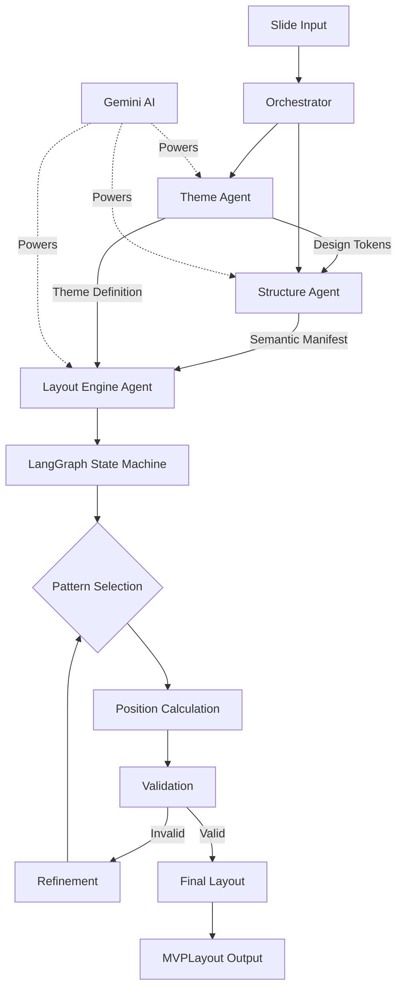

# Layout Architect Three-Agent Architecture

## Overview

The Layout Architect has been redesigned as a sophisticated three-agent system that uses AI and specialized tools to generate optimal slide layouts. This architecture replaces the rigid rule-based approach with intelligent agents that understand design principles, content semantics, and visual composition.

## Core Philosophy

"Using an LLM for structure interpretation is much smarter than trying to program all the pattern matching logic" - this insight drives our three-agent architecture where each agent specializes in a specific aspect of layout generation.

## Three-Agent System

### 1. Theme Agent - Brand & Style Director
**Role**: Creates cohesive design systems using W3C Design Tokens format

**Capabilities**:
- Generates comprehensive design tokens (colors, typography, spacing)
- Creates color palettes with WCAG accessibility compliance
- Finds appropriate font pairings based on context
- Defines layout zones and templates

**Tools**:
- `ColorPaletteGenerator`: Creates harmonious, accessible color schemes
- `FontPairingFinder`: Selects typography combinations
- `LayoutZoneDefiner`: Establishes grid zones for content placement

### 2. Structure Agent - Content Strategist
**Role**: Analyzes slide content to identify semantic roles and relationships

**Capabilities**:
- Identifies semantic roles (headline, key takeaway, evidence, etc.)
- Detects relationships between content elements
- Determines optimal content flow patterns
- Establishes visual hierarchy

**Tools**:
- `ContentParser`: Breaks down content into semantic containers
- `RelationshipAnalyzer`: Identifies connections between elements
- `HierarchyDetector`: Determines visual priority and groupings

### 3. Layout Engine Agent - Master Artisan
**Role**: Generates optimal layouts through iterative refinement

**Capabilities**:
- Applies sophisticated layout patterns (golden ratio, rule of thirds, etc.)
- Calculates precise grid positions
- Validates layouts against constraints
- Iteratively refines based on feedback

**Tools**:
- `LayoutPatternGenerator`: Selects appropriate patterns
- `GridPositionCalculator`: Determines exact positions
- `LayoutValidator`: Checks constraints and balance
- `VisualBalanceScorer`: Analyzes visual weight distribution

## Architecture Flow



## Key Models

### Design Tokens (W3C Format)
```python
class DesignTokens(BaseModel):
    colors: Dict[str, ColorToken]
    typography: Dict[str, TypographyToken]
    spacing: Dict[str, DimensionToken]
    sizing: Dict[str, DimensionToken]
```

### Semantic Containers
```python
class SemanticContainer(BaseModel):
    id: str
    role: ContainerRole  # HEADLINE, KEY_TAKEAWAY, etc.
    content: str
    hierarchy_level: int
    importance: ContentImportance
    visual_weight: float
```

### Layout State (LangGraph)
```python
class LayoutState(BaseModel):
    theme: ThemeDefinition
    manifest: ContainerManifest
    status: LayoutStatus
    current_proposal: Optional[LayoutProposal]
    validation_report: Optional[ValidationReport]
```

## Iterative Refinement Process

The Layout Engine uses a LangGraph state machine for iterative refinement:

1. **Initialize**: Set up state with theme and manifest
2. **Propose**: Generate layout using pattern and positioning tools
3. **Validate**: Check constraints, white space, alignment, balance
4. **Refine**: Adjust based on validation feedback
5. **Finalize**: Output validated layout

## Grid System

- **Dimensions**: 160×90 integer-based grid
- **Margins**: Minimum 8 units
- **Gutters**: 4 units between elements
- **Positioning**: All values must be integers
- **White Space**: Target 30-50% for optimal balance

## Integration with Deckster

### Input
- Receives approved strawman from Director IN
- Accepts user context and presentation metadata

### Output
- Generates MVPLayout with precise container positions
- Maintains compatibility with WebSocket protocol
- Provides theme and layout data for Director OUT

## Benefits of Three-Agent Architecture

1. **Intelligence over Rules**: LLMs understand context better than hard-coded logic
2. **Specialization**: Each agent focuses on its domain expertise
3. **Flexibility**: Easy to adjust behavior through prompts
4. **Quality**: Iterative refinement ensures optimal results
5. **Scalability**: Can handle diverse content types and styles

## Usage Example

```python
from src.agents.layout_architect import (
    LayoutArchitectOrchestrator,
    LayoutGenerationRequest
)

# Create orchestrator
orchestrator = LayoutArchitectOrchestrator()

# Generate layout
request = LayoutGenerationRequest(
    slide=slide_data,
    user_context={"brand": "TechCorp", "industry": "Healthcare"},
    presentation_context={"tone": "professional"}
)

result = await orchestrator.generate_layout(request)

# Access results
layout = result.layout
theme = result.theme
manifest = result.manifest
```

## Configuration

The system supports configuration through `LayoutEngineConfig`:
- Maximum iterations for refinement
- White space ratio targets
- Alignment tolerance
- Balance score thresholds

## Error Handling

The system gracefully handles errors with:
- Fallback layouts for critical failures
- Partial success with best-effort results
- Detailed error reporting in generation metrics

## Future Enhancements

1. **Learning**: Collect feedback to improve pattern selection
2. **Templates**: Expand template library based on usage
3. **Customization**: Allow user-defined constraints
4. **Performance**: Optimize for faster generation
5. **Analytics**: Track layout effectiveness metrics