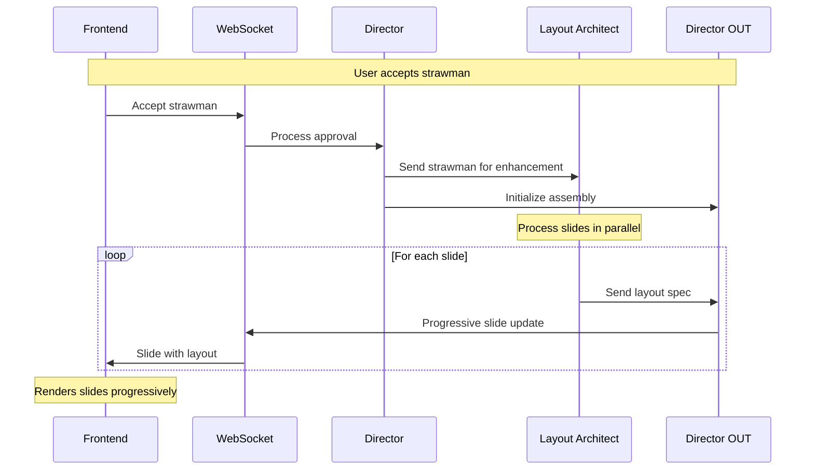

# Deckster WebSocket Communication Protocol - Phase 2

## Overview

This document extends the Phase 1 WebSocket Communication Protocol to support parallel agent architecture, progressive slide delivery, and theme-based grid layouts. Phase 2 introduces the Layout Architect as the first parallel agent and establishes infrastructure for multi-agent collaboration.

**Important:** This document describes ONLY the additions and changes from Phase 1. All Phase 1 functionality remains unchanged unless explicitly noted.

## New Core Principles (Phase 2)

5. **Progressive Enhancement**: Slides improve incrementally as agents contribute
6. **Container-Level Updates**: Granular updates without re-sending entire slides
7. **State Transparency**: Frontend knows the status of each content component
8. **Theme-Driven Rendering**: Grid-based layouts with theme configuration

## Extended Message Types

### 5. Theme Update (`theme_update`) - NEW

Delivers theme configuration for grid-based rendering.

```json
{
  "message_id": "msg_theme_001",
  "session_id": "session_xyz",
  "timestamp": "2024-01-01T10:00:00.000Z",
  "type": "theme_update",
  "payload": {
    "theme_name": "corporate",
    "theme_config": {
      "layouts": {
        "titleSlide": {
          "containers": {
            "title": { "leftInset": 20, "topInset": 35, "width": 120, "height": 20 },
            "subtitle": { "leftInset": 20, "topInset": 55, "width": 120, "height": 10 }
          }
        }
      },
      "typography": {
        "h1": { "fontSize": 48, "fontFamily": "Inter", "fontWeight": "bold" }
      },
      "colors": {
        "primary": "#0066cc",
        "background": "#ffffff"
      }
    },
    "delivery_timing": "before_slides"  // or "with_first_slide"
  }
}
```

**Frontend Action:** Load theme configuration and prepare rendering engine.

### 6. Content State Update (`content_state_update`) - NEW

Tracks multi-agent progress for transparency.

```json
{
  "message_id": "msg_state_001",
  "session_id": "session_xyz",
  "timestamp": "2024-01-01T10:00:00.000Z",
  "type": "content_state_update",
  "payload": {
    "slide_states": {
      "slide_001": {
        "agents": {
          "layout_architect": {
            "status": "complete",
            "timestamp": "2024-01-01T10:00:05Z"
          },
          "researcher": {
            "status": "pending",
            "estimated_time": 10
          },
          "visual_designer": {
            "status": "pending",
            "estimated_time": 15
          }
        },
        "overall_progress": 33
      },
      "slide_002": {
        "agents": {
          "layout_architect": {
            "status": "processing",
            "progress": 60
          }
        },
        "overall_progress": 0
      }
    },
    "presentation_progress": 15
  }
}
```

**Frontend Action:** Update progress indicators and loading states.

### Enhanced Slide Update (Phase 2 Changes)

The `slide_update` message type gains new capabilities for progressive delivery:

```json
{
  "type": "slide_update",
  "payload": {
    "operation": "progressive_update",  // NEW operation type
    "update_sequence": 1,  // NEW: Tracks update order
    "metadata": {
      // Existing metadata fields
      "theme_name": "corporate"  // NEW: Theme reference
    },
    "slides": [
      {
        // Existing slide fields remain
        "slide_id": "slide_001",
        "slide_number": 1,
        "slide_type": "title_slide",
        
        // NEW Phase 2 fields
        "layout": "titleSlide",  // Theme layout reference
        "layout_spec": {  // From Layout Architect
          "source": "theme",
          "layout_hints": {
            "content_density": "low",
            "visual_emphasis": 0.8,
            "preferred_flow": "vertical"
          }
        },
        
        // NEW: Content state tracking
        "content_state": {
          "base_content": "complete",  // From Director/strawman
          "layout": "complete",         // From Layout Architect
          "research": "pending",        // From Researcher (Phase 3)
          "visuals": "pending",        // From Visual Designer (Phase 3)
          "charts": "not_applicable"   // From Data Analyst (Phase 3)
        },
        
        // NEW: Container-based content
        "containers": [
          {
            "name": "title",
            "content": {
              "type": "text",
              "text": "AI in Healthcare",
              "style": "h1"
            },
            "position": "from_theme"  // or custom GridPosition
          },
          {
            "name": "subtitle",
            "content": {
              "type": "placeholder",  // NEW content type
              "placeholder_type": "text",
              "loading_state": {
                "message": "Enhancing content...",
                "agent": "researcher",
                "estimated_time": 5
              }
            }
          }
        ]
      }
    ],
    "affected_slides": ["slide_001"]
  }
}
```

### 7. Container Update (`container_update`) - NEW

Granular updates for individual containers without re-sending entire slides.

```json
{
  "message_id": "msg_container_001",
  "session_id": "session_xyz",
  "timestamp": "2024-01-01T10:00:10.000Z",
  "type": "container_update",
  "payload": {
    "slide_id": "slide_001",
    "update_sequence": 2,
    "containers": [
      {
        "name": "subtitle",
        "content": {
          "type": "text",
          "text": "Transforming Patient Care Through Innovation",
          "style": "h3"
        },
        "contributor": "researcher"
      }
    ],
    "content_state_change": {
      "research": "complete"
    }
  }
}
```

**Frontend Action:** Update specific containers without re-rendering entire slide.

## Parallel Agent Communication Flow

### After Strawman Approval



### Progressive Enhancement Flow

```json
// Step 1: Initial slide with base content
{
  "type": "slide_update",
  "payload": {
    "operation": "progressive_update",
    "update_sequence": 1,
    "slides": [{
      "slide_id": "slide_002",
      "layout": "contentSlide",
      "content_state": {
        "base_content": "complete",
        "layout": "processing",
        "research": "pending"
      },
      "containers": [{
        "name": "title",
        "content": { "type": "text", "text": "Market Analysis" }
      }, {
        "name": "body",
        "content": { 
          "type": "placeholder",
          "placeholder_type": "content",
          "loading_state": { "message": "Analyzing layout..." }
        }
      }]
    }]
  }
}

// Step 2: Layout complete
{
  "type": "container_update",
  "payload": {
    "slide_id": "slide_002",
    "update_sequence": 2,
    "containers": [{
      "name": "body",
      "content": { "type": "text", "text": "Initial content from strawman" },
      "position": { "leftInset": 10, "topInset": 30, "width": 140, "height": 50 }
    }],
    "content_state_change": { "layout": "complete" }
  }
}

// Step 3: Research enhancement (Phase 3)
{
  "type": "container_update",
  "payload": {
    "slide_id": "slide_002",
    "update_sequence": 3,
    "containers": [{
      "name": "body",
      "content": { 
        "type": "text", 
        "text": "Enhanced content with latest market data and insights..."
      }
    }],
    "content_state_change": { "research": "complete" }
  }
}
```

## Theme Integration Protocol

### Theme Delivery Timing

1. **Option A: Before First Slide**
   ```json
   // Message 1: Theme
   { "type": "theme_update", "payload": { ... } }
   
   // Message 2: First slide
   { "type": "slide_update", "payload": { ... } }
   ```

2. **Option B: With Presentation Metadata**
   ```json
   {
     "type": "slide_update",
     "payload": {
       "metadata": {
         "theme_name": "corporate",
         "theme_url": "/api/themes/corporate.json"  // Frontend fetches
       }
     }
   }
   ```

### Theme-Layout Mapping

The Layout Architect provides layout names that map to theme layouts:

```json
{
  "slide_type": "content_heavy",
  "layout": "contentSlide",  // Maps to theme.layouts.contentSlide
  "layout_spec": {
    "source": "theme",
    "layout_hints": {
      "content_density": "high"
    }
  }
}
```

## State-Specific Message Flows (Phase 2 Updates)

### 6. ENHANCE_LAYOUT (NEW State)
**Messages sent:** Variable (1 per slide + status updates)
- `status_update`: "Enhancing layouts..." (immediate)
- `slide_update`: Progressive updates per slide
- `content_state_update`: Progress tracking

### 7+ Additional Parallel States (Phase 3)
Reserved for future agents:
- RESEARCH_CONTENT
- IMAGINE_VISUALS  
- BUILD_CHARTS
- DRAW_FRAMEWORKS

## Error Handling (Phase 2 Additions)

### Agent-Specific Errors

```json
{
  "type": "container_update",
  "payload": {
    "slide_id": "slide_003",
    "error": {
      "agent": "layout_architect",
      "error_type": "generation_failed",
      "message": "Unable to generate layout for complex content",
      "fallback": "default_layout"
    },
    "containers": [{
      "name": "body",
      "content": { "type": "text", "text": "..." },
      "position": "from_theme"  // Using fallback
    }],
    "content_state_change": {
      "layout": "error"
    }
  }
}
```

### Partial Failure Handling

When one agent fails, others continue:

```json
{
  "type": "content_state_update",
  "payload": {
    "slide_states": {
      "slide_004": {
        "agents": {
          "layout_architect": { "status": "complete" },
          "researcher": { "status": "error", "fallback": "base_content" },
          "visual_designer": { "status": "processing" }
        }
      }
    }
  }
}
```

## Frontend Implementation Guidelines (Phase 2)

### State Management

```javascript
// Enhanced slide state structure
const slideStates = {
  'slide_001': {
    baseContent: { status: 'complete', data: {...} },
    enhancements: {
      layout: { status: 'complete', data: {...} },
      research: { status: 'pending', estimatedTime: 10 },
      visuals: { status: 'pending' }
    },
    containers: {
      'title': { content: {...}, position: {...} },
      'body': { content: {...}, position: {...} }
    }
  }
}
```

### Progressive Rendering

1. **Initial Render**: Show base content with theme defaults
2. **Layout Application**: Apply custom positioning when ready
3. **Content Enhancement**: Replace placeholders as content arrives
4. **Error States**: Show appropriate fallbacks

### Container Update Handling

```javascript
function handleContainerUpdate(message) {
  const { slide_id, containers, content_state_change } = message.payload;
  
  // Update specific containers
  containers.forEach(update => {
    updateSlideContainer(slide_id, update.name, update.content);
  });
  
  // Update content state
  if (content_state_change) {
    updateSlideState(slide_id, content_state_change);
  }
  
  // Trigger efficient re-render
  renderAffectedContainers(slide_id, containers);
}
```

## Protocol Version Detection

Frontend can detect Phase 2 protocol by:

1. Presence of `theme_update` message type
2. `progressive_update` operation in slide updates
3. `content_state` field in slides
4. `container_update` message type

```javascript
const protocolVersion = {
  phase1: hasBasicMessageTypes(),
  phase2: hasThemeUpdate() || hasProgressiveUpdates(),
  phase3: hasMultiAgentContent()
};
```

## Migration Considerations

### From Phase 1 to Phase 2

1. **Backward Compatible**: All Phase 1 messages continue to work
2. **Graceful Degradation**: If frontend doesn't support Phase 2, falls back to Phase 1 behavior
3. **Feature Detection**: Frontend can selectively enable Phase 2 features

### Preparing for Phase 3

The Phase 2 protocol is designed to easily extend for additional agents:

```json
{
  "content_state": {
    "base_content": "complete",
    "layout": "complete",        // Phase 2
    "research": "processing",     // Phase 3
    "visuals": "pending",        // Phase 3
    "charts": "pending",         // Phase 3
    "diagrams": "not_applicable" // Phase 3
  }
}
```

## Performance Optimizations

### Delta Updates

Container updates send only changed data:

```json
{
  "type": "container_update",
  "payload": {
    "slide_id": "slide_001",
    "containers": [{
      "name": "insights",
      "content": {
        "type": "text",
        "text": "New insights added...",
        "delta": true  // Only the new content
      }
    }]
  }
}
```

### Batched Updates

Multiple container updates can be batched:

```json
{
  "type": "container_update",
  "payload": {
    "updates": [
      { "slide_id": "slide_001", "containers": [...] },
      { "slide_id": "slide_002", "containers": [...] }
    ]
  }
}
```

## Summary of Phase 2 Additions

1. **New Message Types**:
   - `theme_update`: Theme configuration delivery
   - `content_state_update`: Multi-agent progress tracking
   - `container_update`: Granular content updates

2. **Enhanced Features**:
   - Progressive slide delivery
   - Container-based content model
   - Agent contribution tracking
   - Theme-driven layouts

3. **Protocol Extensions**:
   - `progressive_update` operation
   - `content_state` tracking
   - `layout_spec` integration
   - Error handling per agent

4. **Frontend Benefits**:
   - Faster initial render
   - Smooth progressive enhancement
   - Clear loading states
   - Efficient updates

This Phase 2 protocol establishes the foundation for true parallel agent processing while maintaining simplicity and backward compatibility. The focus on progressive enhancement ensures users see content as quickly as possible while the system continues to improve each slide in the background.