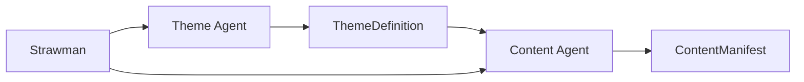

# Enhanced Theme-Content Agent Collaboration

## Overview

The enhanced Theme and Content Agents work together to create a cohesive, theme-aware presentation generation system. This document describes the integration and testing approach.

## Architecture Flow



## Key Enhancements

### Theme Agent Enhancements

1. **Strawman Analysis**: Analyzes the entire presentation strawman (not just individual slides)
2. **Mood Extraction**: Extracts actionable mood keywords from overall_theme and design_suggestions
3. **Comprehensive Design System**: Creates:
   - Color palette with semantic colors
   - Typography system with font pairings
   - Layout templates for all slide types
   - Visual guidelines for content generation

4. **New Tools**:
   - `analyze_mood_and_keywords_tool`: Extracts design keywords
   - `generate_color_palette_tool`: Creates accessible color systems
   - `find_font_pairing_tool`: Selects optimal typography
   - `design_layout_templates_tool`: Creates layout blueprints

### Content Agent Enhancements

1. **Deck-Level Context**: Receives a deck_summary parameter for narrative awareness
2. **Theme Integration**: Uses ThemeDefinition to guide all content generation:
   - Injects mood keywords into text
   - Specifies theme colors in visuals
   - Applies visual guidelines to images/diagrams
   - Respects layout template constraints

3. **External Information**: New search capabilities:
   - `internal_knowledge_search_tool`: RAG search for company data
   - `web_search_tool`: External statistics and benchmarks

4. **Enhanced Models**:
   - `TextContent`: Added sources field for attribution
   - `VisualSpec`: Added style_preference and theme alignment fields

## Testing the Integration

### 1. Create Test Strawman

```python
strawman = PresentationStrawman(
    main_title="Digital Transformation Strategy 2025",
    overall_theme="Modern, data-driven, innovative leadership",
    design_suggestions="Tech aesthetic, blues/teals, clean fonts",
    target_audience="Executive leadership team",
    presentation_duration=20,
    slides=[...]
)
```

### 2. Generate Theme

```python
theme_agent = ThemeAgent()
theme = await theme_agent.generate_theme(
    strawman=strawman,
    session_id="test_001"
)

# Theme contains:
# - mood_keywords: ["modern", "data-driven", "innovative", ...]
# - design_tokens: colors, typography, spacing
# - visual_guidelines: photography style, icon style, etc.
# - layout_templates: for each slide type
```

### 3. Generate Content with Theme

```python
content_agent = ContentAgent()
deck_summary = "2-paragraph narrative summary..."

manifest = await content_agent.prepare_content(
    slide=slide,
    deck_summary=deck_summary,
    theme=theme,
    strawman_metadata={...},
    session_id="test_001"
)

# Manifest includes:
# - Theme-aware text with mood keywords
# - Visual specs with theme colors
# - Source attributions from searches
# - Layout-respecting content volumes
```

## Verification Points

### Theme Agent Output
- ✓ Mood keywords extracted from overall_theme
- ✓ Color palette matches design suggestions
- ✓ Font pairing suits target audience
- ✓ Layout templates for all slide types
- ✓ Visual guidelines established

### Content Agent Output
- ✓ Text incorporates mood keywords
- ✓ Word counts adjusted for audience/theme
- ✓ Visual specs use theme colors
- ✓ Diagrams follow theme style
- ✓ Sources tracked when searches used
- ✓ Content respects layout zones

## Example Theme-Content Flow

1. **Theme Analysis**:
   - Input: "Modern, data-driven, innovative"
   - Output: mood_keywords = ["modern", "innovative", "tech-forward", "analytical"]

2. **Color Generation**:
   - Mood: "modern" + "tech" → Primary: #0066cc (blue)
   - Accessibility: AA compliant contrast ratios

3. **Content Generation**:
   - Slide: "Market Opportunity Analysis"
   - Theme colors specified in charts
   - Text uses keywords: "innovative market approach"
   - Search finds: "Cloud market $1.5T by 2027"
   - Sources tracked: ["https://statista.com/..."]

## Running Tests

1. Install dependencies:
   ```bash
   pip install -r requirements.txt
   ```

2. Run test script:
   ```bash
   python test_enhanced_agents.py
   ```

3. Expected output:
   - Theme generation with mood keywords
   - Content manifests for each slide type
   - Theme integration verification
   - Source attribution examples

## Key Benefits

1. **Consistency**: Every slide follows the same design language
2. **Context Awareness**: Content understands its role in the narrative
3. **Resourcefulness**: External information enhances credibility
4. **Flexibility**: Adapts to different audiences and formality levels
5. **Traceability**: Sources tracked for all external content

## Next Steps

1. Integration with visual generation services
2. Real-time theme adjustments based on user feedback
3. Enhanced search with vector databases
4. A/B testing different theme variations
5. Performance optimization for large presentations