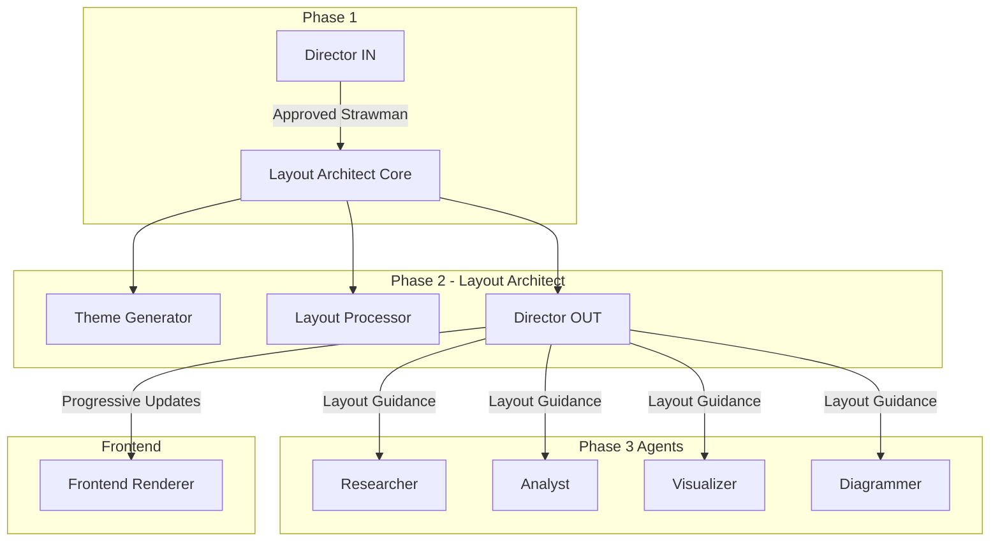
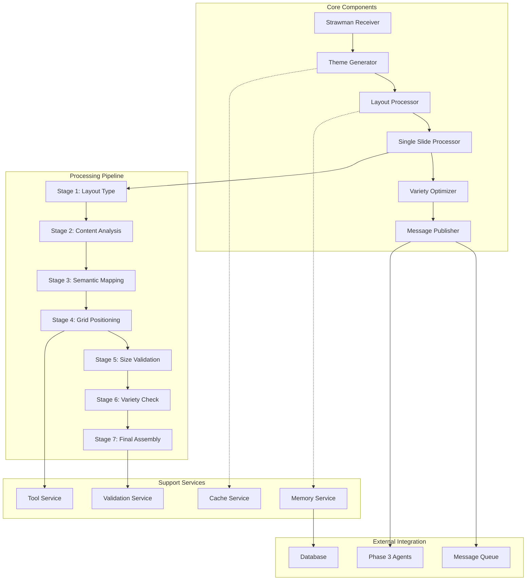
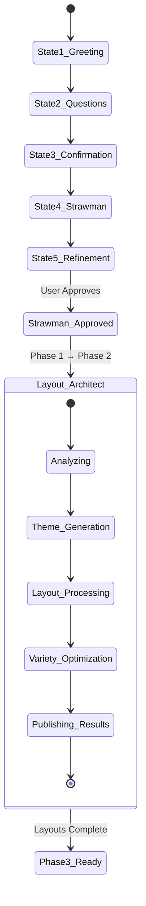
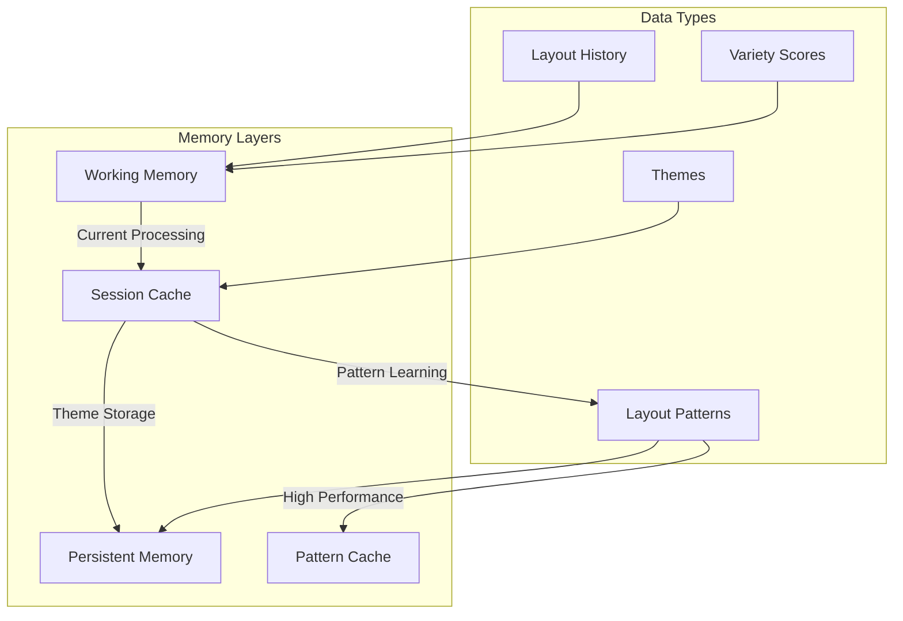

# Layout Architect Solution Architecture

## Table of Contents
1. [Executive Summary](#executive-summary)
2. [Architecture Overview](#architecture-overview)
3. [Design Principles](#design-principles)
4. [Architecture Patterns](#architecture-patterns)
5. [Component Architecture](#component-architecture)
6. [Technical Architecture](#technical-architecture)
   - [Core Processing Pipeline](#core-processing-pipeline)
   - [Data Models](#data-models)
   - [Agent Configuration](#agent-configuration)
   - [Tools and Deterministic Functions](#tools-and-deterministic-functions)
   - [AI-Driven Functions](#ai-driven-functions)
7. [Integration Architecture](#integration-architecture)
   - [Phase 1 Integration](#phase-1-integration)
   - [Phase 3 Agent Guidance](#phase-3-agent-guidance)
   - [Message Queue Architecture](#message-queue-architecture)
8. [Memory and State Management](#memory-and-state-management)
9. [System Design Considerations](#system-design-considerations)
10. [Appendices](#appendices)

## Executive Summary

The Layout Architect is a sophisticated visual intelligence agent that serves as the critical bridge between Phase 1's strategic content planning and Phase 3's content generation. It transforms approved presentation strawman into professional, varied, and visually compelling layouts while generating complete presentation themes.

### Key Responsibilities
- **Theme Generation**: Creates cohesive visual design systems including layouts, typography, and color palettes
- **Layout Intelligence**: Applies design principles to create optimal layouts for each slide
- **Container Orchestration**: Precisely positions and sizes content containers using a 160×90 grid system
- **Variety Management**: Ensures visual diversity while maintaining consistency
- **Progressive Delivery**: Provides real-time layout updates as slides are processed
- **Agent Coordination**: Supplies layout guidance to all Phase 3 specialist agents

### Architectural Highlights
- **Hybrid Intelligence**: Combines AI reasoning for creative decisions with deterministic tools for precision
- **Seven-Stage Processing**: Comprehensive layout generation pipeline ensuring quality
- **Pattern Learning**: Continuously improves through successful layout pattern recognition
- **Scalable Design**: Processes up to 30 slides concurrently with sub-2s per slide performance

## Architecture Overview

The Layout Architect employs a sophisticated multi-layered architecture designed to balance creative flexibility with technical precision. At its core, the system separates concerns between creative decision-making (handled by AI) and mathematical precision (handled by deterministic tools).

### System Context



### Core Architecture Philosophy

The Layout Architect is built on the principle of **"Creative AI, Precise Tools"**. This means:

1. **AI handles subjective decisions**: Theme aesthetics, layout selection, visual hierarchy
2. **Tools handle objective calculations**: Grid positioning, container sizing, collision detection
3. **Memory enables learning**: Successful patterns improve future layouts
4. **Workflow ensures quality**: Seven-stage processing pipeline validates every decision

This separation ensures that creative decisions benefit from AI's pattern recognition and aesthetic judgment, while mathematical operations remain deterministic and testable.

## Design Principles

The Layout Architect enforces five critical professional design principles that ensure every presentation meets executive standards. These principles guide all architectural decisions and processing stages.

### 1. White Space (Negative Space)
Creates breathing room and focus through deliberate empty space:
- **Generous Margins**: Minimum 8 grid units on all edges
- **Consistent Gutters**: 4 grid units between all containers
- **Strategic Spacing**: Calculated distances between elements
- **30-50% Target**: Optimal white space ratio for professional layouts

### 2. Grid Alignment
Ensures precision and order through integer-based positioning:
- **160×90 Integer Grid**: All positions and dimensions use whole numbers only
- **Row/Column System**: Similar elements align to consistent rows and columns
- **Dimension Consistency**: Related elements share identical widths and heights
- **Edge Alignment**: Elements in logical groups share X or Y coordinates
- **100% Accuracy**: No fractional values allowed in positioning

### 3. Visual Balance
Creates stability through deliberate weight distribution:
- **Asymmetrical Balance**: Large elements balanced by smaller ones + white space
- **Symmetrical Options**: Mirror layouts for formal presentations
- **Weight Calculation**: Size × color intensity × content density
- **90% Threshold**: Minimum balance score for all layouts

### 4. Component Highlighting
Guides attention to key insights through strategic emphasis:
- **Single Focus**: One highlighted element per slide maximum
- **Isolation Spacing**: Extra white space around key components
- **Accent Color**: Reserved for most important data only
- **Size Hierarchy**: Key elements 1.2-1.5× larger

### 5. Functional Minimalism
Eliminates decoration in favor of clarity:
- **No Chartjunk**: Remove all unnecessary visual elements
- **Purpose-Driven**: Every element must serve a function
- **Simple Forms**: Basic shapes and clean lines only
- **Zero Decoration**: No purely aesthetic elements

### Supporting Architectural Principles

#### Progressive Enhancement
The system applies design principles incrementally:
- **Stage 1**: Layout structure selection
- **Stages 2-3**: Content analysis with minimalism filtering
- **Stage 4**: Grid positioning with all 5 principles
- **Stage 5**: Size validation and capacity checks
- **Stage 6**: Design principle scoring and validation
- **Stage 7**: Final assembly and quality assurance

#### Fail-Safe Design
Maintains professional quality even under failure:
- **Fallback Layouts**: Pre-validated templates when generation fails
- **Principle Enforcement**: Never compromise on design standards
- **Validation Layers**: Multiple checks ensure compliance
- **Quality Gates**: Reject layouts that don't meet standards

## Architecture Patterns

### Repository Pattern for Memory Management

The Layout Architect implements a repository pattern for managing themes, patterns, and layout history. This provides:

```python
class LayoutRepository:
    """Abstraction layer for all layout-related data access"""
    
    async def get_theme(self, session_id: str) -> Optional[Theme]
    async def save_theme(self, session_id: str, theme: Theme) -> str
    async def get_patterns(self, content_type: str) -> List[Pattern]
    async def save_pattern(self, pattern: Pattern) -> str
```

**Benefits**:
- Decouples business logic from data access
- Enables easy testing with mock repositories
- Supports multiple storage backends
- Provides consistent caching layer

### Strategy Pattern for Layout Selection

Different slide types require different layout strategies. The system uses a strategy pattern:

```python
class LayoutStrategy(ABC):
    """Base strategy for layout generation"""
    
    @abstractmethod
    async def generate_layout(self, slide: Slide, theme: Theme) -> Layout

class TitleSlideStrategy(LayoutStrategy):
    """Strategy for title slide layouts"""
    
class DataDrivenStrategy(LayoutStrategy):
    """Strategy for data-heavy slide layouts"""
    
class ContentHeavyStrategy(LayoutStrategy):
    """Strategy for text-heavy slide layouts"""
```

**Benefits**:
- Easy addition of new layout strategies
- Clear separation of layout logic
- Testable individual strategies
- Runtime strategy selection

### Factory Pattern for Container Creation

Containers are created through a factory pattern based on content type:

```python
class ContainerFactory:
    """Creates appropriate containers based on content type"""
    
    @staticmethod
    def create_container(
        content_type: str,
        content: Any,
        theme: Theme
    ) -> Container:
        if content_type == "text":
            return TextContainer(content, theme.typography)
        elif content_type == "chart":
            return ChartContainer(content, theme.colors)
        elif content_type == "table":
            return TableContainer(content, theme.typography)
        # ... more container types
```

**Benefits**:
- Centralized container creation logic
- Type-specific initialization
- Consistent container properties
- Easy extension for new types

### Observer Pattern for Progressive Updates

The system implements an observer pattern for real-time updates:

```python
class LayoutObserver(ABC):
    """Observer interface for layout updates"""
    
    @abstractmethod
    async def on_slide_complete(self, slide_id: str, layout: Layout)
    
class DirectorOUTObserver(LayoutObserver):
    """Sends layouts to Director OUT for assembly"""
    
class FrontendObserver(LayoutObserver):
    """Sends progressive updates to frontend"""
    
class Phase3Observer(LayoutObserver):
    """Notifies Phase 3 agents of layout completion"""
```

**Benefits**:
- Decoupled notification system
- Multiple observers without code changes
- Real-time progress tracking
- Easy addition of new observers

### Chain of Responsibility for Validation

Layout validation uses a chain of responsibility pattern to ensure all design principles are met:

```python
class ValidationHandler(ABC):
    """Base validation handler"""
    
    def __init__(self, next_handler: Optional['ValidationHandler'] = None):
        self.next_handler = next_handler
    
    async def validate(self, layout: Layout) -> ValidationResult:
        result = await self._validate(layout)
        if result.is_valid and self.next_handler:
            return await self.next_handler.validate(layout)
        return result

# Design Principle Validators
class WhiteSpaceValidator(ValidationHandler):
    """Validates 30-50% white space ratio and margins/gutters"""
    min_ratio = 0.3
    max_ratio = 0.5
    min_margin = 8
    standard_gutter = 4

class GridAlignmentValidator(ValidationHandler):
    """Validates all containers use integer coordinates"""
    def validate_integer_positions(self, containers):
        # Check all X and Y are whole numbers
        # Verify related elements share coordinates
        # Ensure consistent dimensions

class BalanceValidator(ValidationHandler):
    """Validates visual balance exceeds 90% threshold"""
    balance_threshold = 0.9

class HighlightingValidator(ValidationHandler):
    """Validates single focal point with proper emphasis"""
    max_highlights = 1
    min_isolation_space = 2

class MinimalismValidator(ValidationHandler):
    """Validates no decorative elements exist"""
    allowed_decorative_count = 0

# Technical Validators
class GridBoundsValidator(ValidationHandler):
    """Validates containers fit within grid"""

class CapacityValidator(ValidationHandler):
    """Validates text capacity limits"""

class OverlapValidator(ValidationHandler):
    """Validates no container overlaps"""
```

**Validation Chain Configuration**:
```python
# Professional layout validation chain
validation_chain = WhiteSpaceValidator(
    GridAlignmentValidator(
        BalanceValidator(
            HighlightingValidator(
                MinimalismValidator(
                    GridBoundsValidator(
                        CapacityValidator(
                            OverlapValidator()
                        )
                    )
                )
            )
        )
    )
)
```

**Benefits**:
- Enforces all design principles systematically
- Fails fast on principle violations
- Clear validation priority order
- Easy to adjust validation strictness

## Component Architecture

The Layout Architect consists of several interconnected components, each with specific responsibilities:

### High-Level Component Diagram



### Component Responsibilities

#### 1. Strawman Receiver
- **Purpose**: Entry point for approved strawman from Phase 1
- **Responsibilities**:
  - Validates strawman structure and completeness
  - Extracts metadata for theme generation
  - Initializes processing context
  - Triggers theme generation

#### 2. Theme Generator
- **Purpose**: Creates comprehensive visual design system
- **Responsibilities**:
  - Analyzes presentation context (audience, formality, purpose)
  - Generates complete typography hierarchy (15 levels)
  - Creates cohesive color palette with semantic colors
  - Defines layouts for each slide type
  - Establishes visual tone and style

#### 3. Layout Processor
- **Purpose**: Orchestrates slide-by-slide layout generation
- **Responsibilities**:
  - Manages concurrent slide processing
  - Coordinates the 7-stage pipeline
  - Handles error recovery
  - Tracks processing progress

#### 4. Single Slide Processor
- **Purpose**: Implements the 7-stage layout generation pipeline
- **Responsibilities**:
  - Executes each stage sequentially
  - Maintains stage context
  - Handles stage-specific errors
  - Produces final layout specification

#### 5. Variety Optimizer
- **Purpose**: Ensures visual diversity across presentation
- **Responsibilities**:
  - Calculates variety scores
  - Identifies repetitive patterns
  - Regenerates low-variety layouts
  - Maintains layout history

#### 6. Message Publisher
- **Purpose**: Delivers layouts to downstream systems
- **Responsibilities**:
  - Formats layout messages
  - Publishes to message queues
  - Notifies Phase 3 agents
  - Handles delivery failures

### Support Services

#### Memory Service
Manages persistent and session-based storage:
- Theme caching with TTL
- Layout pattern storage
- Variety tracking history
- Session state management

#### Cache Service
Provides high-speed data access:
- In-memory theme cache
- Pattern cache with LRU eviction
- Layout history buffer
- Performance metrics cache

#### Validation Service
Ensures layout correctness:
- Grid boundary validation
- Container overlap detection
- Capacity limit checking
- Theme compliance verification

#### Tool Service
Provides deterministic calculations:
- Grid positioning algorithms
- Container sizing logic
- Variety score calculation
- Visual balance computation

## Technical Architecture

### Core Processing Pipeline

The Layout Architect implements a sophisticated 7-stage pipeline for generating optimal layouts. Each stage builds upon the previous, ensuring comprehensive analysis and precise execution.

#### Stage 1: Initial Layout Type Determination

This stage establishes the foundational layout approach based on slide type and theme capabilities.

```python
async def stage1_determine_layout_type(
    self,
    slide: Slide,
    theme: ThemeSpecification
) -> LayoutStrategy:
    """
    Determines the appropriate layout strategy based on slide type.
    
    For title slides and section dividers, uses complete theme layouts.
    For content slides, uses flexible body area with theme header/footer.
    """
    if slide.slide_type in ["title_slide", "section_header"]:
        # Use complete pre-defined theme layout
        return ThemeLayoutStrategy(theme.layouts[slide.slide_type])
    else:
        # Use flexible body area approach
        return CustomBodyLayoutStrategy(
            header=theme.layouts["contentSlide"].header,
            footer=theme.layouts["contentSlide"].footer,
            body_zone=theme.layouts["contentSlide"].body_zone
        )
```

**Key Decisions**:
- Title and section slides get full theme layouts
- Content slides get flexible body areas for dynamic content
- Strategy pattern enables easy extension

#### Stage 2: Content Decomposition and Analysis

This stage breaks down slide content into logical containers and analyzes their requirements.

```python
async def stage2_content_decomposition(
    self,
    slide: Slide,
    content_registry: ContentTypeRegistry
) -> ContainerManifest:
    """
    Decomposes slide content into typed containers with metadata.
    
    Identifies special requirements for first-class objects:
    - Tables: Row/column structure preservation
    - Code blocks: Syntax highlighting needs
    - Charts: Label and legend space
    - Icons: Dynamic theme coloring
    """
    containers = []
    
    # Analyze each content element
    for element in slide.content_elements:
        container_type = content_registry.identify_type(element)
        
        # Special handling for first-class objects
        if container_type == "table":
            containers.append(TableContainer(
                content=element,
                preserve_structure=True,
                header_emphasis=True
            ))
        elif container_type == "code":
            containers.append(CodeContainer(
                content=element,
                syntax_highlight=True,
                theme="monokai"
            ))
        # ... more special cases
        
    # Analyze relationships and z-index needs
    z_index_map = self._analyze_layering_needs(containers)
    
    return ContainerManifest(
        containers=containers,
        z_index_map=z_index_map,
        content_density=self._calculate_density(containers)
    )
```

**Content Type Categories**:
- **Text Elements**: Headers, body, bullets, quotes, footnotes
- **Data Elements**: Tables, charts, metrics, timelines
- **Code Elements**: Code blocks, inline code
- **Media Elements**: Images, icons, videos, GIFs
- **Interactive Elements**: CTAs, links, QR codes
- **Structural Elements**: Shapes, dividers, progress bars
- **Decorative Elements**: Backgrounds, watermarks, badges

#### Stage 3: Content Representation Strategy

This stage maps semantic meaning to visual representations.

```python
async def stage3_content_representation(
    self,
    manifest: ContainerManifest,
    slide_type: str,
    semantic_mapper: SemanticMapper
) -> EnhancedManifest:
    """
    Maps content to visual treatments based on semantic meaning.
    
    Applies slide-type-specific strategies and assigns typography.
    """
    enhanced_containers = []
    
    for container in manifest.containers:
        # Determine semantic type
        semantic_type = semantic_mapper.classify(
            container.content,
            container.type,
            slide_type
        )
        
        # Apply visual treatment
        visual_treatment = self._get_visual_treatment(semantic_type)
        
        # Assign typography level
        typography = self._assign_typography(
            semantic_type,
            container.hierarchy
        )
        
        # Determine space allocation
        space_allocation = self._calculate_space_allocation(
            container.content_volume,
            container.priority,
            manifest.content_density
        )
        
        enhanced_containers.append(
            EnhancedContainer(
                **container.dict(),
                semantic_type=semantic_type,
                visual_treatment=visual_treatment,
                typography=typography,
                space_allocation=space_allocation
            )
        )
    
    return EnhancedManifest(
        containers=enhanced_containers,
        layout_pattern=self._select_layout_pattern(
            slide_type,
            enhanced_containers
        )
    )
```

**Semantic Mappings**:
| Content Purpose | Semantic Type | Visual Treatment | Typography |
|-----------------|---------------|------------------|------------|
| Main point | KeyTakeaway | Wide, prominent, top | h2/lead |
| Statistics | KeyMetric | Large number display | metric |
| Process | ProcessFlow | Horizontal with arrows | body |
| Comparison | ComparisonFramework | Side-by-side containers | body |

#### Stage 4: Grid Positioning with Professional Design Principles

This stage applies all five design principles through mathematical positioning and validation.

```python
async def stage4_grid_positioning(
    self,
    enhanced_manifest: EnhancedManifest,
    body_zone: GridZone,
    design_tools: DesignPrincipleTools
) -> PositionedManifest:
    """
    Positions containers using all five professional design principles.
    
    Systematically applies white space, grid alignment, balance,
    highlighting, and minimalism to create professional layouts.
    """
    # Step 1: Apply White Space Principle
    # Calculate margins and available area
    margin = 8  # Generous margins (8 GU minimum)
    gutter = 4  # Consistent gutters between containers
    
    available_area = GridArea(
        x=body_zone.x + margin,
        y=body_zone.y + margin,
        width=body_zone.width - (2 * margin),
        height=body_zone.height - (2 * margin)
    )
    
    # Step 2: Apply Grid Alignment Principle
    # Use direct 160×90 integer grid
    grid = IntegerGridSystem(
        width=160,
        height=90,
        enforce_integers=True
    )
    
    # Step 3: Apply Functional Minimalism
    # Filter containers through minimalism check
    functional_containers = await design_tools.enforce_minimalism(
        enhanced_manifest.containers
    )
    
    # Step 4: Apply Component Highlighting
    # Identify and prepare focal element
    focal_container = identify_focal_element(functional_containers)
    if focal_container:
        focal_container.add_isolation_space(2)  # Extra white space
        focal_container.apply_accent_color()
        focal_container.scale_size(1.2)  # 20% larger
    
    # Step 5: Position with Balance Principle
    positioned_containers = []
    visual_weights = []
    
    # Sort by importance and z-index
    sorted_containers = sort_by_hierarchy_and_layer(functional_containers)
    
    for container in sorted_containers:
        # Calculate position using integer grid alignment
        grid_position = grid.find_optimal_position(
            container=container,
            existing=positioned_containers,
            focal_point=container == focal_container,
            enforce_row_column_alignment=True
        )
        
        # Ensure consistent dimensions for related elements
        grid_position = ensure_dimension_consistency(
            grid_position,
            container,
            related_containers=find_related(container, positioned_containers)
        )
        
        # Ensure minimum gutters (integer values)
        grid_position = ensure_gutters(
            grid_position,
            positioned_containers,
            min_gutter=gutter
        )
        
        # Calculate visual weight for balance
        weight = calculate_visual_weight(
            container,
            grid_position,
            theme_colors
        )
        visual_weights.append(weight)
        
        positioned_containers.append(
            PositionedContainer(
                **container.dict(),
                position=position
            )
        )
        
        occupied_spaces.append(position)
    
    return PositionedManifest(
        containers=positioned_containers,
        visual_balance=positioning_engine.calculate_balance(
            positioned_containers
        )
    )
```

**Positioning Principles**:
- **Rule of Thirds**: Focal points at x=53, 107; y=30, 60
- **Optical Centering**: Text positioned slightly above true center
- **Visual Weight Balance**: Large/dark elements balanced with whitespace
- **Standardized Gutters**: 4 GU minimum between containers

#### Stage 5: Precise Sizing and Capacity Validation

This stage calculates exact dimensions and validates content capacity.

```python
async def stage5_size_validation(
    self,
    positioned_manifest: PositionedManifest,
    typography_system: TypographySystem,
    sizing_engine: SizingEngine
) -> SizedManifest:
    """
    Calculates precise dimensions and validates capacity.
    
    Ensures text fits, maintains aspect ratios, and respects minimums.
    """
    sized_containers = []
    
    for container in positioned_manifest.containers:
        # Calculate dimensions based on content
        dimensions = sizing_engine.calculate_dimensions(
            content_type=container.type,
            content_volume=container.content_volume,
            available_space=container.allocated_space,
            constraints=self._get_size_constraints(container.type)
        )
        
        # Validate capacity for text containers
        if container.type in ["text", "title", "quote"]:
            capacity = sizing_engine.calculate_text_capacity(
                dimensions=dimensions,
                typography=typography_system.levels[container.typography],
                padding=container.padding
            )
            
            # Check overflow
            actual_chars = len(container.content)
            if actual_chars > capacity.max_characters:
                # Attempt to resize
                dimensions = sizing_engine.expand_for_text(
                    dimensions,
                    required_chars=actual_chars,
                    max_bounds=container.allocated_space
                )
                capacity = sizing_engine.recalculate_capacity(
                    dimensions,
                    typography_system.levels[container.typography]
                )
        
        sized_containers.append(
            SizedContainer(
                **container.dict(),
                dimensions=dimensions,
                capacity=capacity if container.type in ["text", "title", "quote"] else None
            )
        )
    
    return SizedManifest(
        containers=sized_containers,
        validation_status=self._validate_all_constraints(sized_containers)
    )
```

**Sizing Constraints**:
| Content Type | Min Size (GU) | Optimal Ratio | Special Requirements |
|--------------|---------------|---------------|---------------------|
| Text | 40×15 | Golden (1.618:1) | Line height consideration |
| Charts | 40×30 | 4:3 | Space for labels/legend |
| Images | 30×20 | 16:9 or 4:3 | Aspect preservation |
| Tables | 60×10/row | Variable | Header emphasis |

#### Stage 6: Design Principle Validation and Scoring

This stage validates adherence to all five professional design principles.

```python
async def stage6_design_principle_validation(
    self,
    sized_manifest: SizedManifest,
    theme: ThemeSpecification,
    design_validators: DesignValidators
) -> ValidatedManifest:
    """
    Validates and scores layout against all design principles.
    
    Ensures professional quality through systematic validation.
    """
    # Validate each principle
    validation_results = {}
    
    # 1. White Space Validation
    white_space_result = await design_validators.validate_white_space(
        slide_dimensions=GridDimensions(160, 90),
        containers=sized_manifest.containers
    )
    validation_results["white_space"] = {
        "score": white_space_result.ratio_score,
        "ratio": white_space_result.ratio,
        "target_met": white_space_result.target_met,
        "violations": white_space_result.violations
    }
    
    # 2. Grid Alignment Validation
    alignment_result = await design_validators.validate_grid_alignment(
        containers=sized_manifest.containers,
        grid_columns=12
    )
    validation_results["grid_alignment"] = {
        "score": alignment_result.alignment_score,
        "violations": alignment_result.violations,
        "perfect": alignment_result.aligned
    }
    
    # 3. Visual Balance Validation
    balance_result = await design_validators.validate_balance(
        containers=sized_manifest.containers,
        theme_colors=theme.colors
    )
    validation_results["balance"] = {
        "score": balance_result.balance_score,
        "meets_threshold": balance_result.meets_threshold,
        "distribution": balance_result.weight_distribution
    }
    
    # 4. Highlighting Validation
    highlight_result = await design_validators.validate_highlighting(
        containers=sized_manifest.containers,
        theme=theme
    )
    validation_results["highlighting"] = {
        "score": highlight_result.effectiveness_score,
        "single_focus": highlight_result.single_focus_maintained,
        "violations": highlight_result.violations
    }
    
    # 5. Minimalism Validation
    minimalism_result = await design_validators.validate_minimalism(
        containers=sized_manifest.containers
    )
    validation_results["minimalism"] = {
        "score": minimalism_result.compliance_score,
        "decorative_elements": minimalism_result.decorative_count,
        "functional_ratio": minimalism_result.functional_ratio
    }
    
    # Calculate overall score
    overall_score = calculate_overall_design_score(validation_results)
    
    # Reject if below threshold
    if overall_score < 0.9:
        optimization_strategies = [
            "horizontal_flip",
            "spacing_adjustment",
            "alignment_rotation",
            "focal_point_shift"
        ]
        
        for strategy in optimization_strategies:
            optimized_manifest = variety_analyzer.apply_optimization(
                manifest=optimized_manifest,
                strategy=strategy
            )
            
            # Recalculate score
            new_score = variety_analyzer.calculate_score(
                current_layout=optimized_manifest,
                history=layout_history[-5:]
            )
            
            if new_score >= 0.8:
                break
    
    return OptimizedManifest(
        containers=optimized_manifest.containers,
        variety_score=variety_score,
        optimizations_applied=optimizations
    )
```

**Variety Strategies**:
- **Layout Type Rotation**: Alternate between different patterns
- **Position Variation**: Flip, shift, or rotate arrangements
- **Spacing Modulation**: Vary density and whitespace
- **Focal Point Movement**: Change visual emphasis location

#### Stage 7: Final Layout Assembly and Validation

This stage assembles all components and performs final validation.

```python
async def stage7_final_assembly(
    self,
    optimized_manifest: OptimizedManifest,
    theme: ThemeSpecification,
    layout_assembler: LayoutAssembler
) -> SlideLayoutSpec:
    """
    Assembles final layout with all specifications.
    
    Merges theme elements, validates constraints, and generates hints.
    """
    # Merge theme header/footer with body containers
    final_containers = layout_assembler.merge_theme_elements(
        theme_containers=theme.get_frame_containers(),
        body_containers=optimized_manifest.containers
    )
    
    # Apply final styling
    styled_containers = []
    for container in final_containers:
        styling = layout_assembler.apply_styling(
            container=container,
            theme_colors=theme.colors,
            theme_effects=theme.effects
        )
        
        styled_containers.append(
            FinalContainer(
                **container.dict(),
                styling=styling
            )
        )
    
    # Validate all constraints
    validation_results = layout_assembler.validate_final_layout(
        containers=styled_containers,
        constraints={
            "grid_bounds": GridConstraint(160, 90),
            "no_overlaps": True,
            "capacity_limits": True,
            "theme_compliance": True
        }
    )
    
    if not validation_results.is_valid:
        # Apply corrections
        styled_containers = layout_assembler.correct_violations(
            containers=styled_containers,
            violations=validation_results.violations
        )
    
    # Generate rendering hints
    layout_hints = layout_assembler.generate_hints(
        containers=styled_containers,
        content_density=optimized_manifest.content_density,
        visual_emphasis=optimized_manifest.visual_emphasis
    )
    
    return SlideLayoutSpec(
        slide_id=slide.slide_id,
        layout_source="custom" if custom_body else "theme",
        layout_name=optimized_manifest.layout_pattern,
        containers=styled_containers,
        layout_hints=layout_hints,
        variety_score=optimized_manifest.variety_score
    )
```

**Final Validation Checks**:
- All containers within 160×90 grid bounds
- No container overlaps
- Text capacity within limits
- Theme compliance verified
- Visual hierarchy maintained

### Data Models

The Layout Architect uses comprehensive data models to ensure type safety and clear interfaces throughout the system.

#### Core Input/Output Models

```python
from pydantic import BaseModel, Field, ConfigDict
from typing import List, Optional, Dict, Any, Literal
from datetime import datetime

# Theme Models
class ThemeSpecification(BaseModel):
    """Complete theme package"""
    theme_name: str
    formality_level: Literal["casual", "professional", "formal"]
    visual_tone: Literal["modern", "classic", "playful", "serious"]
    
    layouts: Dict[str, LayoutDefinition]
    typography: TypographySystem
    colors: ColorPalette
    grid_specifications: Dict[str, GridSpec]

class LayoutDefinition(BaseModel):
    """Theme layout definition for a slide type"""
    layout_name: str
    layout_type: str
    containers: List[ContainerDefinition]
    zones: Dict[str, GridZone]  # header, footer, body zones
    default_hints: LayoutHints

class GridZone(BaseModel):
    """Defines a zone within the grid"""
    x: int = Field(ge=0, le=160)
    y: int = Field(ge=0, le=90)
    width: int = Field(ge=1, le=160)
    height: int = Field(ge=1, le=90)
    role: Literal["header", "footer", "body", "sidebar"]
```

#### Typography System Models

```python
class TypographySystem(BaseModel):
    """Complete typography hierarchy"""
    font_families: FontStack
    levels: Dict[str, TypographyLevel]
    contextual_sizes: Dict[str, Dict[str, float]]

class FontStack(BaseModel):
    """Font family definitions"""
    primary: List[str] = ["Inter", "-apple-system", "sans-serif"]
    monospace: List[str] = ["Fira Code", "Consolas", "monospace"]
    display: Optional[List[str]] = ["Playfair Display", "serif"]

class TypographyLevel(BaseModel):
    """Individual typography specification"""
    level_name: str  # h1-h6, body, lead, small, caption, etc.
    font_size: float
    font_weight: int = Field(ge=100, le=900)
    line_height: float = Field(ge=1.0, le=2.0)
    letter_spacing: float
    text_transform: Optional[Literal["uppercase", "lowercase", "capitalize"]]
    color_variants: Dict[str, str]  # default, emphasized, muted, interactive
```

#### Color System Models

```python
class ColorPalette(BaseModel):
    """Theme color system"""
    primary: str
    secondary: str
    accent: str
    background: ColorSet
    text: ColorSet
    semantic: SemanticColors
    data_visualization: List[str] = Field(min_items=6, max_items=8)

class ColorSet(BaseModel):
    """Set of related colors"""
    default: str
    light: str
    dark: str
    contrast: str

class SemanticColors(BaseModel):
    """Semantic color definitions"""
    success: str = "#00aa44"
    warning: str = "#ffaa00"
    error: str = "#ff0044"
    info: str = "#0066cc"
```

#### Container Models

```python
class Container(BaseModel):
    """Base container model"""
    container_id: str
    container_type: Literal[
        "text", "image", "chart", "table", "code",
        "shape", "icon", "video", "interactive"
    ]
    content_ref: Optional[str]  # Reference to strawman content
    position: GridPosition
    dimensions: GridDimensions
    z_index: int = Field(ge=1, le=10)
    
class TextContainer(Container):
    """Text-specific container"""
    container_type: Literal["text"] = "text"
    typography_level: str
    capacity: TextCapacity
    alignment: Literal["left", "center", "right", "justify"] = "left"
    
class ChartContainer(Container):
    """Chart-specific container"""
    container_type: Literal["chart"] = "chart"
    chart_subtype: Literal["bar", "line", "pie", "scatter"]
    label_zones: Dict[str, GridDimensions]
    color_sequence: List[str]
    
class TableContainer(Container):
    """Table-specific container"""
    container_type: Literal["table"] = "table"
    row_count: int
    column_count: int
    header_style: Dict[str, Any]
    cell_padding: int = 2  # Grid units
    
class CodeContainer(Container):
    """Code block container"""
    container_type: Literal["code"] = "code"
    syntax_language: Optional[str]
    theme: Literal["monokai", "solarized", "github"] = "monokai"
    line_numbers: bool = True
```

#### Layout Specification Models

```python
class SlideLayoutSpec(BaseModel):
    """Complete layout specification for a slide"""
    slide_id: str
    layout_source: Literal["theme", "custom"]
    layout_name: str
    containers: List[Container]
    layout_hints: LayoutHints
    variety_score: float = Field(ge=0.0, le=1.0)
    processing_metadata: ProcessingMetadata

class LayoutHints(BaseModel):
    """Rendering guidance for frontend"""
    content_density: Literal["high", "medium", "low"]
    visual_emphasis: float = Field(ge=0.0, le=1.0)
    preferred_flow: Literal["vertical", "horizontal", "grid"]
    color_intensity: Literal["muted", "balanced", "vibrant"] = "balanced"
    spacing_preference: Literal["compact", "balanced", "airy"] = "balanced"
    animation_suggestions: Optional[List[str]] = None

class ProcessingMetadata(BaseModel):
    """Metadata about layout processing"""
    generation_time_ms: int
    stages_completed: List[str]
    optimizations_applied: List[str]
    pattern_references: List[str]
    theme_version: str
```

### Agent Configuration

The Layout Architect agent is configured with a comprehensive system prompt that guides its creative decision-making while leveraging tools for precision tasks.

```python
from pydantic_ai import Agent
from pydantic_ai.models.gemini import GeminiModel
import logfire

# Configure observability
logfire.configure(service_name="layout_architect")
logfire.instrument_pydantic_ai()

# System prompt emphasizing the agent's role and capabilities
LAYOUT_ARCHITECT_PROMPT = """
You are the Layout Architect, the visual intelligence bridge between strategic content 
planning (Phase 1) and content generation (Phase 3) in Deckster's multi-agent system.

Your mission is to transform approved presentation strawman into visually stunning, 
professionally designed layouts that enhance communication effectiveness.

CORE PRINCIPLES:
1. Every design decision should enhance the message, not distract from it
2. Visual variety maintains engagement while consistency ensures professionalism
3. Content drives layout, not the other way around
4. Accessibility and readability are non-negotiable
5. Cultural sensitivity in visual choices matters

YOUR CREATIVE RESPONSIBILITIES:

1. THEME GENERATION:
   - Analyze the holistic presentation context
   - Consider audience expectations and cultural factors
   - Create cohesive visual language that supports the narrative
   - Balance innovation with familiarity
   - Ensure themes work across all slide types

2. LAYOUT SELECTION:
   - Match visual structures to content intent
   - Apply proven design patterns appropriately
   - Consider information hierarchy and reading patterns
   - Ensure each slide serves its purpose effectively
   - Maintain narrative flow through visual consistency

3. VISUAL HIERARCHY:
   - Guide the eye through deliberate design
   - Emphasize key messages through visual weight
   - Create clear primary, secondary, and tertiary levels
   - Use whitespace as an active design element
   - Ensure accessibility for all users

4. CONTENT ANALYSIS:
   - Understand not just what content is, but what it means
   - Identify opportunities for visual enhancement
   - Recognize when simplicity trumps complexity
   - Map abstract concepts to concrete visuals
   - Preserve content integrity while enhancing appeal

YOUR TOOLS FOR PRECISION:
- Grid positioning calculations (mathematical precision)
- Container sizing algorithms (capacity validation)
- Variety scoring systems (diversity measurement)
- Collision detection (overlap prevention)
- Visual balance computation (aesthetic validation)

DECISION FRAMEWORK:
- Creative choices: Trust your design instincts and training
- Mathematical needs: Delegate to precision tools
- System operations: Use provided integrations
- Validation: Always verify outputs meet constraints

CONTEXT AWARENESS:
- You receive: Approved strawman with complete content strategy
- You provide: Complete theme + individual slide layouts
- Your output guides: All Phase 3 agents in their content generation
- Success means: Beautiful, functional, varied, and effective layouts

Remember: Great design is invisible - it amplifies the message without 
drawing attention to itself. Your layouts should make presenters confident 
and audiences engaged.
"""

# Initialize the Layout Architect agent
layout_architect = Agent(
    model=GeminiModel("gemini-1.5-pro"),
    system_prompt=LAYOUT_ARCHITECT_PROMPT,
    deps_type=LayoutArchitectDependencies,
    result_type=None,  # Multiple output types handled dynamically
    name="layout_architect",
    # Agent configuration
    model_settings={
        "temperature": 0.7,  # Balance creativity with consistency
        "top_p": 0.9,
        "max_output_tokens": 4096
    },
    # Retry configuration for robustness
    max_retries=3,
    retry_delay=1.0
)
```

#### Structured Output Enforcement

The agent uses Pydantic models to ensure structured outputs:

```python
# Theme generation with structured output
theme_result = await layout_architect.run(
    prompt=theme_generation_prompt,
    deps=dependencies,
    result_type=ThemeSpecification  # Enforces structured output
)

# Layout generation with structured output
layout_result = await layout_architect.run(
    prompt=layout_generation_prompt,
    deps=dependencies,
    result_type=SlideLayoutSpec  # Enforces structured output
)
```

### Tools and Deterministic Functions

The Layout Architect employs specialized tools for mathematical precision and deterministic operations. These tools ensure consistent, testable behavior for operations that require exact calculations.

#### Grid Positioning Tool

```python
@layout_architect.tool
async def calculate_grid_position(
    ctx: RunContext[LayoutArchitectDependencies],
    container_type: str,
    preferred_position: str,
    existing_containers: List[Dict[str, int]],
    apply_rule_of_thirds: bool = False,
    apply_optical_center: bool = False
) -> GridPosition:
    """
    Calculate optimal grid position using design principles.
    
    This tool applies mathematical rules for precise container placement,
    including Rule of Thirds, optical centering, and collision avoidance.
    
    Args:
        container_type: Type of content (affects positioning rules)
        preferred_position: Desired position (center, top-left, etc.)
        existing_containers: Already positioned containers to avoid
        apply_rule_of_thirds: Snap to rule of thirds grid points
        apply_optical_center: Apply optical centering for text
    
    Returns:
        GridPosition with calculated coordinates
    """
    # Implementation details provided in architecture...
```

#### Container Sizing Tool

```python
@layout_architect.tool
async def calculate_container_size(
    ctx: RunContext[LayoutArchitectDependencies],
    content_type: str,
    content_volume: str,
    available_space: GridDimensions,
    typography_spec: Optional[Dict[str, float]] = None,
    maintain_aspect_ratio: Optional[str] = None
) -> Tuple[GridDimensions, Optional[ContainerCapacity]]:
    """
    Calculate optimal container dimensions with capacity validation.
    
    Determines size based on content type, volume, and constraints while
    calculating text capacity for text-based containers.
    
    Args:
        content_type: Type of content determining size rules
        content_volume: Expected volume (minimal/small/medium/large)
        available_space: Maximum available dimensions
        typography_spec: Font specs for text capacity calculation
        maintain_aspect_ratio: Required aspect ratio (16:9, 4:3, etc.)
    
    Returns:
        Tuple of (dimensions, capacity) where capacity is for text containers
    """
    # Implementation details provided in architecture...
```

#### Variety Scoring Tool

```python
@layout_architect.tool
async def calculate_variety_score(
    ctx: RunContext[LayoutArchitectDependencies],
    current_layout: Dict[str, Any],
    layout_history: List[Dict[str, Any]],
    comparison_window: int = 5,
    weights: Optional[Dict[str, float]] = None
) -> VarietyScore:
    """
    Calculate layout variety score through multi-factor comparison.
    
    Analyzes current layout against recent history considering layout type,
    position similarity, and visual balance distribution.
    
    Args:
        current_layout: Layout to score
        layout_history: Recent layouts for comparison
        comparison_window: Number of recent layouts to compare
        weights: Custom weights for comparison factors
    
    Returns:
        VarietyScore with detailed breakdown
    """
    # Implementation details provided in architecture...
```

#### Visual Balance Calculator

```python
@layout_architect.tool
async def calculate_visual_balance(
    ctx: RunContext[LayoutArchitectDependencies],
    containers: List[PositionedContainer]
) -> VisualBalance:
    """
    Calculate visual balance metrics for layout quality assessment.
    
    Computes center of visual mass and balance distribution to ensure
    aesthetically pleasing layouts.
    
    Args:
        containers: Positioned containers with dimensions
    
    Returns:
        VisualBalance metrics including center point and balance score
    """
    # Implementation details provided in architecture...
```

#### White Space Calculator
```python
@layout_architect.tool
async def calculate_white_space_ratio(
    ctx: RunContext[LayoutArchitectDependencies],
    slide_dimensions: GridDimensions,
    containers: List[PositionedContainer],
    include_margins: bool = True
) -> WhiteSpaceMetrics:
    """
    Calculate white space ratio and distribution metrics.
    
    Ensures professional layouts with 30-50% white space by calculating
    total unused area and validating margin/gutter consistency.
    
    Args:
        slide_dimensions: Total slide area (160×90)
        containers: All positioned containers
        include_margins: Whether to validate margin compliance
    
    Returns:
        WhiteSpaceMetrics with ratio, violations, and distribution
    """
    # Implementation validates margins (8 GU) and gutters (4 GU)
```

#### Grid Alignment Validator
```python
@layout_architect.tool
async def validate_grid_alignment(
    ctx: RunContext[LayoutArchitectDependencies],
    containers: List[PositionedContainer]
) -> GridAlignmentReport:
    """
    Validate all containers use integer coordinates and align properly.
    
    Ensures professional precision by checking:
    - All positions are whole numbers (no decimals)
    - Related elements share row/column positions
    - Consistent dimensions for similar elements
    
    Args:
        containers: Positioned containers to validate
    
    Returns:
        GridAlignmentReport with violations and alignment score
    """
    violations = []
    
    # Check for non-integer positions
    for container in containers:
        if not all(isinstance(v, int) for v in [container.x, container.y, container.width, container.height]):
            violations.append(f"Container {container.id} has non-integer values")
    
    # Check row/column alignment for related elements
    grouped = group_related_containers(containers)
    for group in grouped:
        # Verify same Y for elements in same row
        y_coords = {c.y for c in group if c.row_aligned}
        if len(y_coords) > 1:
            violations.append(f"Row alignment violation: {y_coords}")
        
        # Verify consistent dimensions
        if not all_same([c.width for c in group]):
            violations.append(f"Width consistency violation in group")
    
    return GridAlignmentReport(
        aligned=len(violations) == 0,
        violations=violations
```

#### Component Highlighting Validator
```python
@layout_architect.tool
async def validate_highlighting(
    ctx: RunContext[LayoutArchitectDependencies],
    containers: List[PositionedContainer],
    theme: ThemeSpecification
) -> HighlightingReport:
    """
    Validate highlighting follows single-focus principle.
    
    Ensures only one component is highlighted per slide using accent color,
    size emphasis, or isolation spacing.
    
    Args:
        containers: All containers with highlighting properties
        theme: Theme specification with accent colors
    
    Returns:
        HighlightingReport with violations and effectiveness score
    """
    # Implementation ensures single focal point per slide
```

#### Minimalism Enforcer
```python
@layout_architect.tool
async def enforce_minimalism(
    ctx: RunContext[LayoutArchitectDependencies],
    containers: List[Container],
    content_registry: ContentTypeRegistry
) -> MinimalismReport:
    """
    Remove decorative elements and enforce functional minimalism.
    
    Validates every container serves a functional purpose and removes
    any purely decorative elements.
    
    Args:
        containers: All containers to validate
        content_registry: Registry of functional content types
    
    Returns:
        MinimalismReport with removed elements and compliance score
    """
    # Implementation removes chartjunk, decorative images, excessive effects
```

#### Design Principle Orchestrator
```python
@layout_architect.tool
async def validate_all_principles(
    ctx: RunContext[LayoutArchitectDependencies],
    layout: SlideLayout,
    theme: ThemeSpecification
) -> DesignPrincipleReport:
    """
    Orchestrate validation of all five design principles.
    
    Comprehensive validation ensuring professional quality through
    systematic application of all design principles.
    
    Args:
        layout: Complete slide layout with all containers
        theme: Theme specification for validation context
    
    Returns:
        DesignPrincipleReport with individual and overall scores
    """
    # Runs all validators and aggregates results
```

### AI-Driven Functions

The Layout Architect uses AI for creative and subjective decisions that benefit from pattern recognition and aesthetic judgment.

#### Theme Generation Function

```python
async def generate_theme(
    self,
    strawman: PresentationStrawman,
    preferences: Optional[UserPreferences] = None
) -> ThemeSpecification:
    """
    AI-driven theme generation based on presentation context.
    
    Analyzes the entire presentation context to create a cohesive visual
    design system including layouts, typography, and colors.
    """
    theme_prompt = f"""
    Create a comprehensive visual theme for this presentation:
    
    Context:
    - Title: {strawman.main_title}
    - Audience: {strawman.target_audience}
    - Purpose: {strawman.overall_theme}
    - Duration: {strawman.presentation_duration} minutes
    - Formality: {self._infer_formality(strawman)}
    
    Requirements:
    1. Visual tone matching audience expectations
    2. Complete typography hierarchy (15 levels):
       - h1-h6 (headers)
       - body, lead, small (body text variants)
       - caption, footer (annotations)
       - quote (testimonials)
       - code (technical)
       - metric, label, overline (data display)
    3. Color palette:
       - Primary, secondary, accent colors
       - Background and text color sets
       - Semantic colors (success, warning, error, info)
       - 6-8 data visualization colors
    4. Layout definitions for each slide type:
       - Title slide (complete layout)
       - Section divider (complete layout)
       - Content slide (header/footer/body zones)
    
    Consider:
    - Cultural sensitivity for {strawman.target_audience}
    - Accessibility requirements (WCAG AA compliance)
    - Professional vs creative balance
    - Brand guidelines if provided
    """
    
    result = await layout_architect.run(
        prompt=theme_prompt,
        deps=self.dependencies,
        result_type=ThemeSpecification
    )
    
    return result.data
```

#### Layout Selection Function

```python
async def select_layout_pattern(
    self,
    slide: Slide,
    theme: ThemeSpecification,
    patterns: List[LayoutPattern]
) -> LayoutSelection:
    """
    AI-driven layout pattern selection based on content analysis.
    
    Chooses the most appropriate layout pattern considering content type,
    density, hierarchy, and successful historical patterns.
    """
    selection_prompt = f"""
    Select the optimal layout pattern for this slide:
    
    Slide Context:
    - Type: {slide.slide_type}
    - Title: {slide.title}
    - Content elements: {len(slide.key_points)} key points
    - Has data: {slide.analytics_needed is not None}
    - Has visuals: {slide.visuals_needed is not None}
    - Structure preference: {slide.structure_preference}
    
    Available Patterns:
    {self._format_pattern_options(slide.slide_type)}
    
    Historical Success:
    {self._format_successful_patterns(patterns[:3])}
    
    Selection Criteria:
    1. Content-layout fit (most important)
    2. Visual hierarchy support
    3. Information flow
    4. Variety from recent slides
    5. Audience appropriateness
    
    Choose pattern and explain reasoning.
    """
    
    result = await layout_architect.run(
        prompt=selection_prompt,
        deps=self.dependencies,
        result_type=LayoutSelection
    )
    
    return result.data
```

#### Visual Hierarchy Determination

```python
async def determine_visual_hierarchy(
    self,
    containers: List[Container],
    slide_purpose: str
) -> HierarchyMap:
    """
    AI-driven visual hierarchy assignment for optimal communication.
    
    Analyzes content relationships and assigns visual prominence to guide
    audience attention effectively.
    """
    hierarchy_prompt = f"""
    Determine visual hierarchy for these content elements:
    
    Slide Purpose: {slide_purpose}
    
    Content Elements:
    {self._format_containers_for_analysis(containers)}
    
    Hierarchy Principles:
    1. Primary (highest prominence):
       - Key message or main takeaway
       - Most important data point
       - Central visual element
    
    2. Secondary (supporting prominence):
       - Supporting evidence
       - Context information
       - Explanatory visuals
    
    3. Tertiary (background prominence):
       - Additional details
       - Source citations
       - Decorative elements
    
    Consider:
    - Natural reading patterns (F-pattern, Z-pattern)
    - Cultural reading direction
    - Cognitive load distribution
    - Visual weight balance
    
    Assign hierarchy levels and visual treatments.
    """
    
    result = await layout_architect.run(
        prompt=hierarchy_prompt,
        deps=self.dependencies,
        result_type=HierarchyMap
    )
    
    return result.data
```

#### Content Density Analysis

```python
async def analyze_content_density(
    self,
    slide_content: SlideContent
) -> DensityAnalysis:
    """
    AI-driven content density evaluation for layout decisions.
    
    Assesses information volume and complexity to inform spacing,
    sizing, and layout choices.
    """
    density_prompt = f"""
    Analyze content density for layout planning:
    
    Content Overview:
    - Text volume: {self._calculate_text_volume(slide_content)}
    - Data complexity: {self._assess_data_complexity(slide_content)}
    - Visual elements: {self._count_visual_elements(slide_content)}
    - Interaction points: {self._count_interactions(slide_content)}
    
    Density Factors:
    1. Information density (amount of content)
    2. Cognitive complexity (difficulty to process)
    3. Visual complexity (number of distinct elements)
    4. Interaction complexity (user actions required)
    
    Guidelines:
    - High density: Requires more whitespace, clear separation
    - Medium density: Balance of content and breathing room
    - Low density: Can use larger elements, more emphasis
    
    Assess overall density and provide layout recommendations.
    """
    
    result = await layout_architect.run(
        prompt=density_prompt,
        deps=self.dependencies,
        result_type=DensityAnalysis
    )
    
    return result.data
```

#### Layout Hint Generation

```python
async def generate_layout_hints(
    self,
    layout: SlideLayoutSpec,
    content_characteristics: ContentCharacteristics
) -> LayoutHints:
    """
    AI-driven rendering hints for optimal visual presentation.
    
    Provides nuanced guidance to the frontend for animations, transitions,
    and micro-interactions.
    """
    hints_prompt = f"""
    Generate rendering hints for this layout:
    
    Layout Summary:
    - Pattern: {layout.layout_name}
    - Container count: {len(layout.containers)}
    - Content density: {content_characteristics.density}
    - Visual emphasis: {content_characteristics.emphasis_points}
    
    Hint Categories:
    1. Animation suggestions:
       - Entry animations (subtle, professional)
       - Emphasis animations (draw attention)
       - Transition effects (between slides)
    
    2. Interaction hints:
       - Hover states
       - Click affordances
       - Touch targets (mobile)
    
    3. Responsive behavior:
       - Breakpoint adjustments
       - Reflow strategies
       - Priority preservation
    
    4. Accessibility enhancements:
       - Focus indicators
       - Reading order
       - Screen reader hints
    
    Generate appropriate hints for optimal presentation.
    """
    
    result = await layout_architect.run(
        prompt=hints_prompt,
        deps=self.dependencies,
        result_type=LayoutHints
    )
    
    return result.data
```

## Integration Architecture

### Phase 1 Integration

The Layout Architect seamlessly continues from Phase 1's completion, receiving the approved strawman and transforming it into visual specifications.

#### Handoff Mechanism

```python
class Phase1Integration:
    """Manages handoff from Director IN to Layout Architect"""
    
    async def handle_strawman_approved(
        self,
        session_id: str,
        strawman: PresentationStrawman,
        approval_metadata: ApprovalMetadata
    ) -> LayoutProcessingResult:
        """
        Receives approved strawman from State 5 and initiates layout processing.
        
        Flow:
        1. Validate strawman completeness
        2. Extract processing context
        3. Initialize Layout Architect workflow
        4. Update session state
        5. Begin progressive processing
        """
        # Validate strawman
        validation_result = await self.validate_strawman(strawman)
        if not validation_result.is_valid:
            raise ValueError(f"Invalid strawman: {validation_result.errors}")
        
        # Extract context for theme generation
        processing_context = ProcessingContext(
            presentation_type=strawman.overall_theme,
            target_audience=strawman.target_audience,
            formality_level=self._infer_formality(strawman),
            duration_minutes=strawman.presentation_duration,
            slide_count=len(strawman.slides),
            content_characteristics=self._analyze_content(strawman),
            user_preferences=approval_metadata.user_preferences
        )
        
        # Initialize Layout Architect workflow
        workflow_state = LayoutArchitectState(
            session_id=session_id,
            phase="analyzing",
            strawman=strawman,
            processing_context=processing_context
        )
        
        # Update session state for transition
        await self.session_manager.update_session(
            session_id=session_id,
            current_state={
                "workflow_phase": "layout_generation",
                "phase1_complete": True,
                "phase2_started": datetime.utcnow().isoformat(),
                "strawman_approved": True
            }
        )
        
        # Start layout processing
        result = await self.layout_workflow.process(workflow_state)
        
        return result
```

#### State Transition



### Phase 3 Agent Guidance

The Layout Architect provides comprehensive guidance to all Phase 3 agents, ensuring their content fits perfectly within the designed layouts.

#### Guidance Generation

```python
class Phase3GuidanceGenerator:
    """Generates specific guidance for each Phase 3 agent"""
    
    def generate_researcher_guidance(
        self,
        slide_layout: SlideLayoutSpec
    ) -> ResearcherGuidance:
        """Generate text constraints and hierarchy for Researcher"""
        text_containers = [
            c for c in slide_layout.containers 
            if c.container_type == "text"
        ]
        
        return ResearcherGuidance(
            slide_id=slide_layout.slide_id,
            text_constraints=[
                TextConstraint(
                    container_id=c.container_id,
                    max_characters=c.capacity.max_characters,
                    typography_level=c.typography_level,
                    semantic_role=c.semantic_type,
                    content_ref=c.content_ref
                )
                for c in text_containers
            ],
            hierarchy_map=self._build_hierarchy_map(text_containers)
        )
    
    def generate_analyst_guidance(
        self,
        slide_layout: SlideLayoutSpec
    ) -> AnalystGuidance:
        """Generate visualization constraints for Data Analyst"""
        data_containers = [
            c for c in slide_layout.containers 
            if c.container_type in ["chart", "table", "metric"]
        ]
        
        return AnalystGuidance(
            slide_id=slide_layout.slide_id,
            visualization_constraints=[
                VisualizationConstraint(
                    container_id=c.container_id,
                    dimensions=c.dimensions,
                    chart_type=c.chart_subtype if hasattr(c, 'chart_subtype') else None,
                    color_palette=c.color_sequence if hasattr(c, 'color_sequence') else None,
                    label_zones=c.label_zones if hasattr(c, 'label_zones') else None
                )
                for c in data_containers
            ]
        )
    
    def generate_visualizer_guidance(
        self,
        slide_layout: SlideLayoutSpec
    ) -> VisualizerGuidance:
        """Generate image specifications for Visual Designer"""
        visual_containers = [
            c for c in slide_layout.containers 
            if c.container_type in ["image", "icon", "video"]
        ]
        
        return VisualizerGuidance(
            slide_id=slide_layout.slide_id,
            visual_specifications=[
                VisualSpecification(
                    container_id=c.container_id,
                    dimensions=c.dimensions,
                    aspect_ratio=c.dimensions.width / c.dimensions.height,
                    visual_style=c.visual_treatment,
                    z_index=c.z_index,
                    safe_zones=self._calculate_safe_zones(c, slide_layout)
                )
                for c in visual_containers
            ]
        )
    
    def generate_diagrammer_guidance(
        self,
        slide_layout: SlideLayoutSpec
    ) -> DiagrammerGuidance:
        """Generate diagram constraints for UX Analyst"""
        diagram_containers = [
            c for c in slide_layout.containers 
            if c.container_type in ["diagram", "shape", "flowchart"]
        ]
        
        return DiagrammerGuidance(
            slide_id=slide_layout.slide_id,
            diagram_specifications=[
                DiagramSpecification(
                    container_id=c.container_id,
                    dimensions=c.dimensions,
                    flow_direction=c.flow_direction if hasattr(c, 'flow_direction') else "horizontal",
                    node_constraints=c.node_constraints if hasattr(c, 'node_constraints') else None,
                    connection_style=c.connection_style if hasattr(c, 'connection_style') else "arrows"
                )
                for c in diagram_containers
            ]
        )
```

#### Coordination Protocol

```python
class Phase3CoordinationProtocol:
    """Manages coordination between Layout Architect and Phase 3 agents"""
    
    async def publish_phase3_activation(
        self,
        session_id: str,
        completed_layouts: Dict[str, SlideLayoutSpec],
        theme: ThemeSpecification
    ):
        """
        Publishes activation message for Phase 3 agents with layout guidance.
        """
        # Generate comprehensive guidance package
        guidance_package = Phase3GuidancePackage(
            session_id=session_id,
            theme=theme.dict(),
            slide_count=len(completed_layouts),
            processing_timestamp=datetime.utcnow(),
            agent_guidance={
                "researcher": {},
                "analyst": {},
                "visualizer": {},
                "diagrammer": {}
            }
        )
        
        # Generate guidance for each slide
        for slide_id, layout in completed_layouts.items():
            guidance_package.agent_guidance["researcher"][slide_id] = (
                self.guidance_generator.generate_researcher_guidance(layout)
            )
            guidance_package.agent_guidance["analyst"][slide_id] = (
                self.guidance_generator.generate_analyst_guidance(layout)
            )
            guidance_package.agent_guidance["visualizer"][slide_id] = (
                self.guidance_generator.generate_visualizer_guidance(layout)
            )
            guidance_package.agent_guidance["diagrammer"][slide_id] = (
                self.guidance_generator.generate_diagrammer_guidance(layout)
            )
        
        # Publish to coordination queue
        activation_message = AgentActivationMessage(
            message_type="phase3_activation",
            source="layout_architect",
            session_id=session_id,
            payload=guidance_package.dict(),
            timestamp=datetime.utcnow()
        )
        
        await self.message_queue.publish(
            queue="phase3_coordination",
            message=activation_message
        )
        
        # Update session state
        await self.session_manager.update_session(
            session_id=session_id,
            current_state={
                "phase2_complete": True,
                "phase3_activated": True,
                "activation_timestamp": datetime.utcnow().isoformat()
            }
        )
```

### Message Queue Architecture

The Layout Architect uses a robust message queue system for asynchronous communication and progressive delivery.

#### Queue Design

```python
class LayoutArchitectQueues:
    """Message queue configuration for Layout Architect"""
    
    # Incoming queues
    STRAWMAN_APPROVED = "layout_architect.strawman_approved"
    REFINEMENT_REQUEST = "layout_architect.refinement_request"
    
    # Outgoing queues
    LAYOUT_UPDATES = "layout_architect.layout_updates"
    THEME_GENERATED = "layout_architect.theme_generated"
    PHASE3_ACTIVATION = "phase3.activation"
    
    # Internal queues
    SLIDE_PROCESSING = "layout_architect.internal.slides"
    VARIETY_OPTIMIZATION = "layout_architect.internal.variety"
```

#### Progressive Delivery

```python
class ProgressiveDeliveryManager:
    """Manages progressive delivery of layouts to frontend"""
    
    def __init__(self, message_queue: MessageQueue):
        self.queue = message_queue
        self.delivery_tracker = DeliveryTracker()
    
    async def deliver_slide_layout(
        self,
        session_id: str,
        slide_layout: SlideLayoutSpec
    ):
        """
        Delivers individual slide layout as soon as it's ready.
        """
        # Create delivery message
        update_message = SlideUpdateMessage(
            message_type="slide_layout_update",
            session_id=session_id,
            slide_id=slide_layout.slide_id,
            operation="layout_complete",
            payload={
                "layout": slide_layout.dict(),
                "timestamp": datetime.utcnow().isoformat(),
                "processing_time_ms": slide_layout.processing_metadata.generation_time_ms
            }
        )
        
        # Publish to frontend queue
        await self.queue.publish(
            queue=LayoutArchitectQueues.LAYOUT_UPDATES,
            message=update_message
        )
        
        # Track delivery
        self.delivery_tracker.mark_delivered(
            session_id=session_id,
            slide_id=slide_layout.slide_id
        )
        
        # Log for monitoring
        with logfire.span("slide_layout_delivered"):
            logfire.info(
                "Delivered slide layout",
                session_id=session_id,
                slide_id=slide_layout.slide_id,
                variety_score=slide_layout.variety_score,
                container_count=len(slide_layout.containers)
            )
    
    async def deliver_theme(
        self,
        session_id: str,
        theme: ThemeSpecification
    ):
        """
        Delivers generated theme to frontend and storage.
        """
        theme_message = ThemeGeneratedMessage(
            message_type="theme_generated",
            session_id=session_id,
            payload={
                "theme": theme.dict(),
                "timestamp": datetime.utcnow().isoformat()
            }
        )
        
        await self.queue.publish(
            queue=LayoutArchitectQueues.THEME_GENERATED,
            message=theme_message
        )
```

#### Error Handling and Recovery

```python
class LayoutErrorHandler:
    """Handles errors in layout generation with recovery strategies"""
    
    async def handle_slide_error(
        self,
        error: Exception,
        slide: Slide,
        session_id: str,
        retry_count: int = 0
    ) -> Optional[SlideLayoutSpec]:
        """
        Handles individual slide processing errors with recovery.
        """
        error_type = type(error).__name__
        
        # Log error with context
        with logfire.span("layout_error"):
            logfire.error(
                "Slide layout generation failed",
                session_id=session_id,
                slide_id=slide.slide_id,
                error_type=error_type,
                error_message=str(error),
                retry_count=retry_count
            )
        
        # Determine recovery strategy
        if retry_count < 3 and self._is_retryable(error):
            # Retry with adjusted parameters
            adjusted_params = self._adjust_parameters(error, retry_count)
            return await self.retry_with_params(
                slide=slide,
                params=adjusted_params,
                retry_count=retry_count + 1
            )
        
        # Apply fallback layout
        fallback_layout = await self.generate_fallback_layout(
            slide=slide,
            error_context=str(error)
        )
        
        # Notify about fallback
        await self.notify_fallback_used(
            session_id=session_id,
            slide_id=slide.slide_id,
            reason=str(error)
        )
        
        return fallback_layout
    
    async def generate_fallback_layout(
        self,
        slide: Slide,
        error_context: str
    ) -> SlideLayoutSpec:
        """
        Generates safe fallback layout for error recovery.
        """
        # Determine safe layout based on slide type
        if slide.slide_type == "title_slide":
            layout_name = "simple_title"
        elif slide.slide_type in ["data_driven", "visual_heavy"]:
            layout_name = "single_focal"
        else:
            layout_name = "basic_content"
        
        # Create minimal container set
        containers = [
            Container(
                container_id="fallback_main",
                container_type="text",
                position=GridPosition(x=20, y=20),
                dimensions=GridDimensions(width=120, height=50),
                z_index=2
            )
        ]
        
        return SlideLayoutSpec(
            slide_id=slide.slide_id,
            layout_source="fallback",
            layout_name=layout_name,
            containers=containers,
            layout_hints=LayoutHints(
                content_density="medium",
                visual_emphasis=0.5,
                preferred_flow="vertical"
            ),
            variety_score=0.5,  # Neutral score
            processing_metadata=ProcessingMetadata(
                generation_time_ms=0,
                stages_completed=["fallback"],
                optimizations_applied=[],
                pattern_references=[],
                theme_version="fallback"
            )
        )
```

## Memory and State Management

The Layout Architect implements a sophisticated memory system that combines session-based working memory with persistent pattern learning.

### Memory Architecture Overview



### Working Memory Management

```python
class LayoutWorkingMemory:
    """Manages session-based working memory for layout processing"""
    
    def __init__(self, session_id: str, cache_backend: CacheBackend):
        self.session_id = session_id
        self.cache = cache_backend
        self._layout_history: List[str] = []
        self._variety_scores: Dict[str, float] = {}
        self._processing_queue: List[str] = []
        
    async def add_layout_to_history(
        self,
        slide_id: str,
        layout_name: str,
        variety_score: float
    ):
        """Tracks layout for variety analysis"""
        self._layout_history.append(layout_name)
        self._variety_scores[slide_id] = variety_score
        
        # Maintain sliding window
        if len(self._layout_history) > 10:
            self._layout_history.pop(0)
        
        # Update cache
        await self.cache.set(
            key=f"layout_history:{self.session_id}",
            value=self._layout_history,
            ttl=3600  # 1 hour TTL
        )
    
    def get_recent_layouts(self, count: int = 5) -> List[str]:
        """Returns recent layout names for variety checking"""
        return self._layout_history[-count:]
    
    def get_average_variety_score(self) -> float:
        """Calculates average variety score for session"""
        if not self._variety_scores:
            return 1.0
        return sum(self._variety_scores.values()) / len(self._variety_scores)
```

### Theme Caching Strategy

```python
class ThemeCacheManager:
    """Manages theme caching with intelligent invalidation"""
    
    def __init__(self, cache: CacheBackend, db: DatabaseBackend):
        self.cache = cache
        self.db = db
        self.ttl = timedelta(minutes=30)
        
    async def get_theme(
        self,
        session_id: str
    ) -> Optional[ThemeSpecification]:
        """Retrieves theme with cache-first strategy"""
        # Check L1 cache (in-memory)
        cache_key = f"theme:{session_id}"
        cached = await self.cache.get(cache_key)
        if cached:
            return ThemeSpecification.parse_obj(cached)
        
        # Check L2 storage (database)
        stored = await self.db.get_theme(session_id)
        if stored:
            # Warm L1 cache
            await self.cache.set(
                key=cache_key,
                value=stored.dict(),
                ttl=self.ttl.total_seconds()
            )
            return stored
        
        return None
    
    async def save_theme(
        self,
        session_id: str,
        theme: ThemeSpecification
    ) -> str:
        """Saves theme to both cache and persistent storage"""
        # Save to database
        theme_id = await self.db.save_theme(session_id, theme)
        
        # Update cache
        cache_key = f"theme:{session_id}"
        await self.cache.set(
            key=cache_key,
            value=theme.dict(),
            ttl=self.ttl.total_seconds()
        )
        
        # Track theme usage for analytics
        await self._track_theme_usage(theme)
        
        return theme_id
```

### Pattern Learning System

```python
class PatternLearningSystem:
    """Learns from successful layout patterns to improve future generation"""
    
    def __init__(self, repository: PatternRepository):
        self.repository = repository
        self.effectiveness_threshold = 0.7
        self.learning_rate = 0.1
        
    async def learn_from_layout(
        self,
        layout: SlideLayoutSpec,
        feedback: Optional[LayoutFeedback] = None
    ):
        """Learns from generated layout, especially with user feedback"""
        # Calculate initial effectiveness
        effectiveness = self._calculate_effectiveness(
            layout=layout,
            feedback=feedback
        )
        
        if effectiveness >= self.effectiveness_threshold:
            # Store as successful pattern
            pattern = LayoutPattern(
                pattern_name=f"{layout.layout_name}_{layout.slide_id}",
                content_type=self._infer_content_type(layout),
                layout_spec=layout.dict(),
                effectiveness_score=effectiveness,
                content_characteristics=self._extract_characteristics(layout),
                created_at=datetime.utcnow()
            )
            
            await self.repository.save_pattern(pattern)
            
            # Update related patterns
            await self._update_related_patterns(pattern)
    
    async def get_relevant_patterns(
        self,
        content_type: str,
        characteristics: ContentCharacteristics,
        limit: int = 5
    ) -> List[LayoutPattern]:
        """Retrieves most relevant patterns for content type"""
        # Get base patterns for content type
        patterns = await self.repository.get_patterns_by_type(
            content_type=content_type,
            min_effectiveness=self.effectiveness_threshold,
            limit=limit * 2  # Get more for filtering
        )
        
        # Rank by relevance to current characteristics
        ranked_patterns = self._rank_by_relevance(
            patterns=patterns,
            target_characteristics=characteristics
        )
        
        return ranked_patterns[:limit]
    
    def _calculate_effectiveness(
        self,
        layout: SlideLayoutSpec,
        feedback: Optional[LayoutFeedback]
    ) -> float:
        """Calculates effectiveness score for a layout"""
        base_score = layout.variety_score * 0.3
        
        # Design quality metrics
        balance_score = self._assess_visual_balance(layout) * 0.2
        hierarchy_score = self._assess_hierarchy_clarity(layout) * 0.2
        spacing_score = self._assess_spacing_quality(layout) * 0.2
        
        # User feedback weight
        feedback_score = 0.1
        if feedback:
            if feedback.rating == "excellent":
                feedback_score = 0.1
            elif feedback.rating == "good":
                feedback_score = 0.07
            elif feedback.rating == "needs_improvement":
                feedback_score = 0.03
        
        return (
            base_score +
            balance_score +
            hierarchy_score +
            spacing_score +
            feedback_score
        )
```

### State Persistence

```python
class LayoutStatePersistence:
    """Manages persistent state storage for Layout Architect"""
    
    def __init__(self, db: DatabaseBackend):
        self.db = db
        
    async def save_session_state(
        self,
        session_id: str,
        state: LayoutArchitectState
    ):
        """Persists current processing state"""
        state_data = {
            "phase": state.phase,
            "processed_slides": {
                sid: spec.dict() 
                for sid, spec in state.processed_slides.items()
            },
            "layout_history": state.layout_history,
            "variety_tracker": state.variety_tracker,
            "theme_id": state.theme.theme_name if state.theme else None,
            "error_log": state.error_log,
            "timestamp": datetime.utcnow().isoformat()
        }
        
        await self.db.update_session_state(
            session_id=session_id,
            state_key="layout_architect_state",
            state_data=state_data
        )
    
    async def restore_session_state(
        self,
        session_id: str
    ) -> Optional[LayoutArchitectState]:
        """Restores processing state from persistence"""
        state_data = await self.db.get_session_state(
            session_id=session_id,
            state_key="layout_architect_state"
        )
        
        if not state_data:
            return None
        
        # Reconstruct state
        state = LayoutArchitectState(
            session_id=session_id,
            phase=state_data["phase"],
            layout_history=state_data["layout_history"],
            variety_tracker=state_data["variety_tracker"],
            error_log=state_data["error_log"]
        )
        
        # Restore processed slides
        for slide_id, spec_data in state_data["processed_slides"].items():
            state.processed_slides[slide_id] = SlideLayoutSpec.parse_obj(spec_data)
        
        # Restore theme if available
        if state_data.get("theme_id"):
            state.theme = await self._restore_theme(session_id)
        
        return state
```

## Phase 1 Component Integration

The Layout Architect leverages many components already implemented in Phase 1, ensuring architectural consistency and reducing development effort. This section details how existing infrastructure is extended for Phase 2.

### Component Reuse Strategy

The Layout Architect builds upon Phase 1's proven infrastructure while adding specialized functionality for layout generation. Key principles:

1. **Extend, Don't Replace**: Enhance existing components rather than creating parallel systems
2. **Maintain Compatibility**: Ensure Phase 1 functionality remains unaffected
3. **Share Infrastructure**: Reuse WebSocket, session, and database layers
4. **Progressive Enhancement**: Add capabilities incrementally

### WebSocket Infrastructure Extension

#### Existing Infrastructure (Phase 1)
```python
# Current WebSocket handler supports:
- Session management with user_id
- Streamlined protocol (default)
- Intent-based routing
- State machine transitions
- Error handling and recovery
```

#### Layout Architect Integration
```python
class ExtendedWebSocketHandler(WebSocketHandler):
    """Extended handler for Layout Architect integration"""
    
    def __init__(self):
        super().__init__()
        # Add Layout Architect to intent routing
        self.layout_architect = LayoutArchitectAgent()
        
    def _determine_next_state(self, current_state: str, intent: UserIntent, 
                             response: Any, session: Any = None) -> str:
        """Extended state determination including Layout Architect"""
        
        # Existing Phase 1 transitions
        base_next_state = super()._determine_next_state(
            current_state, intent, response, session
        )
        
        # Add Layout Architect trigger
        if (current_state == "GENERATE_STRAWMAN" and 
            intent.intent_type == "Accept_Strawman" and
            self._should_generate_layouts(session)):
            return "LAYOUT_GENERATION"
        
        return base_next_state
    
    async def _handle_layout_generation(
        self,
        websocket: WebSocket,
        session: Session,
        strawman: PresentationStrawman
    ):
        """Handle Layout Architect processing"""
        # Send status update
        await self._send_layout_status(websocket, session.id, "starting")
        
        # Process layouts
        layout_result = await self.layout_architect.process_strawman(
            session_id=session.id,
            strawman=strawman
        )
        
        # Progressive delivery of layouts
        async for layout_update in layout_result.layout_stream:
            await self._send_layout_update(websocket, session.id, layout_update)
```

### Session Management Enhancement

#### Extended Session Model
```python
from src.models.session import Session as BaseSession

class ExtendedSession(BaseSession):
    """Extended session model for Layout Architect"""
    
    # Additional fields for Layout Architect
    layout_generation_state: Optional[Literal[
        "pending", "in_progress", "completed", "failed"
    ]] = None
    generated_theme: Optional[Dict[str, Any]] = None
    layout_history: List[str] = Field(default_factory=list)
    variety_scores: Dict[str, float] = Field(default_factory=dict)
    
    # New states added to existing literals
    current_state: Literal[
        # Phase 1 states
        "PROVIDE_GREETING", 
        "ASK_CLARIFYING_QUESTIONS", 
        "CREATE_CONFIRMATION_PLAN", 
        "GENERATE_STRAWMAN", 
        "REFINE_STRAWMAN",
        # Phase 2 states
        "LAYOUT_GENERATION",
        "LAYOUT_REFINEMENT"
    ] = "PROVIDE_GREETING"
```

#### Session Manager Extension
```python
class ExtendedSessionManager(SessionManager):
    """Extended session manager with Layout Architect support"""
    
    async def save_theme(
        self,
        session_id: str,
        user_id: str,
        theme: ThemeSpecification
    ):
        """Save generated theme to session"""
        await self.save_session_data(
            session_id=session_id,
            user_id=user_id,
            field='generated_theme',
            data=theme.dict()
        )
    
    async def update_layout_history(
        self,
        session_id: str,
        user_id: str,
        slide_id: str,
        layout_name: str,
        variety_score: float
    ):
        """Track layout history for variety management"""
        session = await self.get_or_create(session_id, user_id)
        
        # Update history with sliding window
        session.layout_history.append(layout_name)
        if len(session.layout_history) > 10:
            session.layout_history.pop(0)
        
        # Track variety scores
        session.variety_scores[slide_id] = variety_score
        
        # Persist updates
        await self.update_state(session_id, user_id, session.current_state)
```

### Database Integration

#### Schema Extensions
```sql
-- Phase 1 tables remain unchanged
-- Additional tables for Layout Architect

-- Extend sessions table (via migration)
ALTER TABLE sessions 
ADD COLUMN layout_generation_state TEXT,
ADD COLUMN generated_theme JSONB,
ADD COLUMN layout_history TEXT[],
ADD COLUMN variety_scores JSONB;

-- New tables specific to Layout Architect
CREATE TABLE themes (
    id UUID PRIMARY KEY DEFAULT uuid_generate_v4(),
    session_id TEXT NOT NULL REFERENCES sessions(id),
    theme_name TEXT NOT NULL,
    theme_spec JSONB NOT NULL,
    created_at TIMESTAMPTZ DEFAULT TIMEZONE('utc', NOW()),
    UNIQUE(session_id)
);

CREATE TABLE layout_patterns (
    id UUID PRIMARY KEY DEFAULT uuid_generate_v4(),
    pattern_name TEXT NOT NULL,
    content_type TEXT NOT NULL,
    layout_spec JSONB NOT NULL,
    effectiveness_score FLOAT DEFAULT 0.5,
    usage_count INTEGER DEFAULT 0,
    created_at TIMESTAMPTZ DEFAULT TIMEZONE('utc', NOW()),
    updated_at TIMESTAMPTZ DEFAULT TIMEZONE('utc', NOW())
);

-- Indexes for performance
CREATE INDEX idx_themes_session_id ON themes(session_id);
CREATE INDEX idx_patterns_content_type ON layout_patterns(content_type);
CREATE INDEX idx_patterns_effectiveness ON layout_patterns(effectiveness_score DESC);
```

#### Supabase Operations Extension
```python
class ExtendedSupabaseOperations(SupabaseOperations):
    """Extended operations for Layout Architect"""
    
    def __init__(self):
        super().__init__()
        self.themes_table = "themes"
        self.patterns_table = "layout_patterns"
    
    async def save_theme(
        self,
        session_id: str,
        theme_data: dict
    ) -> str:
        """Save theme with upsert logic"""
        try:
            result = self.client.table(self.themes_table).upsert({
                "session_id": session_id,
                "theme_name": theme_data["theme_name"],
                "theme_spec": theme_data,
                "created_at": datetime.utcnow().isoformat()
            }).execute()
            
            return result.data[0]["id"] if result.data else None
        except Exception as e:
            logger.error(f"Error saving theme: {str(e)}")
            raise
    
    async def get_effective_patterns(
        self,
        content_type: str,
        min_score: float = 0.7,
        limit: int = 5
    ) -> List[dict]:
        """Get high-performing patterns"""
        try:
            result = self.client.table(self.patterns_table)\
                .select("*")\
                .eq("content_type", content_type)\
                .gte("effectiveness_score", min_score)\
                .order("effectiveness_score", desc=True)\
                .limit(limit)\
                .execute()
            
            return result.data
        except Exception as e:
            logger.error(f"Error fetching patterns: {str(e)}")
            return []
```

### Message Protocol Integration

#### Reusing StreamlinedMessagePackager
```python
class LayoutMessagePackager:
    """Layout-specific message packaging using existing infrastructure"""
    
    def __init__(self, base_packager: StreamlinedMessagePackager):
        self.base_packager = base_packager
    
    def package_layout_update(
        self,
        session_id: str,
        slide_id: str,
        layout: SlideLayoutSpec
    ) -> SlideUpdate:
        """Package layout as slide update using existing message type"""
        # Reuse existing slide_update message type
        return create_slide_update(
            session_id=session_id,
            operation="layout_update",
            metadata={
                "layout_name": layout.layout_name,
                "variety_score": layout.variety_score,
                "container_count": len(layout.containers)
            },
            slides=[{
                "slide_id": slide_id,
                "layout": layout.dict()  # Full layout specification
            }],
            affected_slides=[slide_id]
        )
    
    def package_theme_update(
        self,
        session_id: str,
        theme: ThemeSpecification
    ) -> ChatMessage:
        """Package theme as enhanced chat message"""
        return create_chat_message(
            session_id=session_id,
            text="I've created a beautiful theme for your presentation!",
            sub_title=f"Theme: {theme.theme_name}",
            metadata={
                "theme_preview": {
                    "primary_color": theme.colors.primary,
                    "font_family": theme.typography.font_families.primary[0],
                    "visual_tone": theme.visual_tone
                }
            }
        )
```

#### Progressive Layout Delivery
```python
async def deliver_layouts_progressively(
    self,
    websocket: WebSocket,
    session_id: str,
    layout_generator: AsyncIterator[SlideLayoutSpec]
):
    """Deliver layouts as they're generated"""
    completed = 0
    total = 0
    
    async for layout in layout_generator:
        # Package layout update
        update = self.package_layout_update(
            session_id=session_id,
            slide_id=layout.slide_id,
            layout=layout
        )
        
        # Send immediately
        await websocket.send_json(update.model_dump(mode='json'))
        
        completed += 1
        
        # Send progress update every 5 slides
        if completed % 5 == 0:
            progress = create_status_update(
                session_id=session_id,
                status=StatusLevel.GENERATING,
                text=f"Generated layouts for {completed} slides...",
                progress=int((completed / total) * 100) if total else 0
            )
            await websocket.send_json(progress.model_dump(mode='json'))
```

### State Machine Integration

#### Extended State Machine
```python
class ExtendedWorkflowOrchestrator(WorkflowOrchestrator):
    """Extended workflow with Layout Architect states"""
    
    # Additional states
    LAYOUT_STATES = [
        "LAYOUT_GENERATION",
        "LAYOUT_REFINEMENT"
    ]
    
    # Extended transitions
    EXTENDED_TRANSITIONS = {
        **WorkflowOrchestrator.TRANSITIONS,
        "GENERATE_STRAWMAN": ["REFINE_STRAWMAN", "LAYOUT_GENERATION"],
        "LAYOUT_GENERATION": ["LAYOUT_REFINEMENT", "COMPLETE"],
        "LAYOUT_REFINEMENT": ["LAYOUT_GENERATION", "COMPLETE"]
    }
    
    def __init__(self):
        super().__init__()
        self.STATES.extend(self.LAYOUT_STATES)
        self.TRANSITIONS = self.EXTENDED_TRANSITIONS
```

### Benefits of Component Reuse

1. **Reduced Development Time**
   - WebSocket infrastructure ready to use
   - Session management requires minimal extension
   - Database patterns established

2. **Consistent Architecture**
   - Same patterns as Phase 1
   - Familiar code structure
   - Unified error handling

3. **Seamless User Experience**
   - Same connection flow
   - Consistent message formats
   - Progressive enhancement

4. **Operational Efficiency**
   - Shared monitoring and logging
   - Single deployment pipeline
   - Unified configuration

### Migration Considerations

#### Backward Compatibility
- Phase 1 functionality remains unchanged
- New fields are optional with defaults
- State machine supports both flows

#### Database Migrations
```sql
-- Safe migration approach
BEGIN;

-- Add columns with defaults (non-breaking)
ALTER TABLE sessions 
ADD COLUMN IF NOT EXISTS layout_generation_state TEXT DEFAULT NULL,
ADD COLUMN IF NOT EXISTS generated_theme JSONB DEFAULT NULL;

-- Create new tables (non-breaking)
CREATE TABLE IF NOT EXISTS themes (...);
CREATE TABLE IF NOT EXISTS layout_patterns (...);

COMMIT;
```

#### Feature Flags
```python
class LayoutArchitectFeatures:
    """Feature flags for gradual rollout"""
    
    ENABLE_LAYOUT_GENERATION = os.getenv("ENABLE_LAYOUT_GENERATION", "false") == "true"
    ENABLE_PATTERN_LEARNING = os.getenv("ENABLE_PATTERN_LEARNING", "false") == "true"
    ENABLE_PROGRESSIVE_DELIVERY = os.getenv("ENABLE_PROGRESSIVE_DELIVERY", "true") == "true"
    
    @classmethod
    def should_generate_layouts(cls, session: Session) -> bool:
        """Determine if layouts should be generated"""
        return (
            cls.ENABLE_LAYOUT_GENERATION and
            session.presentation_strawman is not None and
            session.layout_generation_state != "completed"
        )
```

## System Design Considerations

### Scalability

The Layout Architect is designed to scale horizontally and vertically to meet growing demands.

#### Horizontal Scaling Strategy

```python
class LayoutArchitectScaling:
    """Manages scaling strategies for Layout Architect"""
    
    def __init__(self, orchestrator: ProcessOrchestrator):
        self.orchestrator = orchestrator
        self.max_concurrent_sessions = 100
        self.max_slides_per_worker = 10
        
    async def distribute_slide_processing(
        self,
        session_id: str,
        slides: List[Slide],
        worker_pool: WorkerPool
    ) -> Dict[str, SlideLayoutSpec]:
        """Distributes slide processing across workers"""
        # Partition slides for workers
        partitions = self._partition_slides(
            slides=slides,
            partition_size=self.max_slides_per_worker
        )
        
        # Create processing tasks
        tasks = []
        for partition in partitions:
            worker = await worker_pool.acquire_worker()
            task = ProcessingTask(
                worker_id=worker.id,
                session_id=session_id,
                slides=partition
            )
            tasks.append(
                self._process_partition(worker, task)
            )
        
        # Process in parallel
        results = await asyncio.gather(*tasks, return_exceptions=True)
        
        # Aggregate results
        processed_slides = {}
        for result in results:
            if isinstance(result, Exception):
                # Handle partial failures
                await self._handle_partition_failure(result)
            else:
                processed_slides.update(result)
        
        return processed_slides
```

#### Vertical Scaling Optimizations

- **Batch Processing**: Group similar operations for efficiency
- **Connection Pooling**: Reuse database and cache connections
- **Memory Management**: Bounded queues and sliding windows
- **Async I/O**: Non-blocking operations throughout

### Performance Optimization

#### Caching Strategy

```python
class PerformanceOptimizer:
    """Optimizes Layout Architect performance"""
    
    def __init__(self):
        self.cache_layers = {
            "L1": InMemoryCache(max_size=1000, ttl=300),
            "L2": RedisCache(ttl=3600),
            "L3": DatabaseCache()
        }
        
    async def get_with_cache(
        self,
        key: str,
        loader_func: Callable,
        cache_levels: List[str] = ["L1", "L2"]
    ) -> Any:
        """Multi-level cache retrieval"""
        # Try each cache level
        for level in cache_levels:
            cache = self.cache_layers[level]
            value = await cache.get(key)
            if value is not None:
                # Promote to higher cache levels
                await self._promote_to_higher_caches(
                    key, value, level, cache_levels
                )
                return value
        
        # Load from source
        value = await loader_func()
        
        # Populate caches
        for level in cache_levels:
            await self.cache_layers[level].set(key, value)
        
        return value
```

#### Batching Strategies

```python
class BatchProcessor:
    """Batches operations for efficiency"""
    
    def __init__(self, batch_size: int = 10, timeout: float = 0.1):
        self.batch_size = batch_size
        self.timeout = timeout
        self._pending_operations = []
        self._batch_lock = asyncio.Lock()
        
    async def add_operation(
        self,
        operation: Operation
    ) -> OperationResult:
        """Adds operation to batch and returns result"""
        async with self._batch_lock:
            self._pending_operations.append(operation)
            
            # Check if batch is ready
            if len(self._pending_operations) >= self.batch_size:
                return await self._execute_batch()
        
        # Wait for timeout or batch to fill
        await asyncio.sleep(self.timeout)
        return await self._execute_batch()
    
    async def _execute_batch(self) -> List[OperationResult]:
        """Executes pending operations as batch"""
        async with self._batch_lock:
            if not self._pending_operations:
                return []
            
            operations = self._pending_operations
            self._pending_operations = []
        
        # Execute batch operation
        results = await self._batch_execute(operations)
        return results
```

### Reliability and Fault Tolerance

#### Circuit Breaker Pattern

```python
class LayoutCircuitBreaker:
    """Implements circuit breaker for fault tolerance"""
    
    def __init__(
        self,
        failure_threshold: int = 5,
        recovery_timeout: float = 60.0
    ):
        self.failure_threshold = failure_threshold
        self.recovery_timeout = recovery_timeout
        self.failure_count = 0
        self.last_failure_time = None
        self.state = "closed"  # closed, open, half_open
        
    async def call(
        self,
        func: Callable,
        fallback_func: Callable,
        *args,
        **kwargs
    ) -> Any:
        """Executes function with circuit breaker protection"""
        # Check circuit state
        if self.state == "open":
            if self._should_attempt_reset():
                self.state = "half_open"
            else:
                return await fallback_func(*args, **kwargs)
        
        try:
            # Attempt the call
            result = await func(*args, **kwargs)
            
            # Success - reset on half_open
            if self.state == "half_open":
                self.state = "closed"
                self.failure_count = 0
            
            return result
            
        except Exception as e:
            # Record failure
            self.failure_count += 1
            self.last_failure_time = datetime.utcnow()
            
            # Check if we should open circuit
            if self.failure_count >= self.failure_threshold:
                self.state = "open"
                logfire.error(
                    "Circuit breaker opened",
                    failure_count=self.failure_count,
                    error=str(e)
                )
            
            # Use fallback
            return await fallback_func(*args, **kwargs)
```

#### Health Monitoring

```python
class LayoutHealthMonitor:
    """Monitors Layout Architect health metrics"""
    
    def __init__(self):
        self.metrics = {
            "theme_generation_time": [],
            "slide_processing_time": [],
            "variety_scores": [],
            "error_rate": 0,
            "cache_hit_rate": 0
        }
        
    async def check_health(self) -> HealthStatus:
        """Performs comprehensive health check"""
        checks = {
            "database": await self._check_database(),
            "cache": await self._check_cache(),
            "message_queue": await self._check_message_queue(),
            "processing_speed": self._check_processing_speed(),
            "error_rate": self._check_error_rate()
        }
        
        overall_status = "healthy"
        for check, status in checks.items():
            if status["status"] == "unhealthy":
                overall_status = "unhealthy"
                break
            elif status["status"] == "degraded":
                overall_status = "degraded"
        
        return HealthStatus(
            status=overall_status,
            checks=checks,
            timestamp=datetime.utcnow()
        )
```

### Security Considerations

#### Input Validation

```python
class LayoutSecurityValidator:
    """Validates inputs for security concerns"""
    
    def validate_strawman(
        self,
        strawman: Dict[str, Any]
    ) -> ValidationResult:
        """Validates strawman for security issues"""
        validators = [
            self._validate_no_injection,
            self._validate_size_limits,
            self._validate_content_safety,
            self._validate_schema_compliance
        ]
        
        for validator in validators:
            result = validator(strawman)
            if not result.is_valid:
                return result
        
        return ValidationResult(is_valid=True)
    
    def _validate_no_injection(
        self,
        data: Dict[str, Any]
    ) -> ValidationResult:
        """Checks for injection attempts"""
        dangerous_patterns = [
            r"<script",
            r"javascript:",
            r"on\w+\s*=",
            r"{\s*\$",
            r"\]\s*\("
        ]
        
        # Recursive check through all strings
        for pattern in dangerous_patterns:
            if self._contains_pattern(data, pattern):
                return ValidationResult(
                    is_valid=False,
                    error=f"Potentially dangerous pattern detected"
                )
        
        return ValidationResult(is_valid=True)
```

#### Output Sanitization

```python
class LayoutOutputSanitizer:
    """Sanitizes outputs before delivery"""
    
    def sanitize_layout_spec(
        self,
        layout: SlideLayoutSpec
    ) -> SlideLayoutSpec:
        """Sanitizes layout specification"""
        # Deep copy to avoid modifying original
        sanitized = layout.copy(deep=True)
        
        # Sanitize text content
        for container in sanitized.containers:
            if hasattr(container, 'content'):
                container.content = self._sanitize_text(container.content)
        
        # Validate positions are within bounds
        for container in sanitized.containers:
            container.position = self._bound_position(container.position)
            container.dimensions = self._bound_dimensions(container.dimensions)
        
        return sanitized
```

## Appendices

### A: Complete Typography Levels Reference

| Level | Purpose | Font Size | Weight | Line Height | Use Cases |
|-------|---------|-----------|--------|-------------|------------|
| **h1** | Main titles | 48-72pt (title) / 32-40pt (content) | 700-800 | 1.2 | Title slides, major sections |
| **h2** | Section headers | 36-48pt (title) / 24-32pt (content) | 600-700 | 1.3 | Section dividers, key points |
| **h3** | Subsection headers | 24-32pt | 600 | 1.4 | Slide titles, major content headers |
| **h4** | Minor headers | 20-24pt | 500-600 | 1.4 | Content sections, list headers |
| **h5** | Sub-subsections | 18-20pt | 500 | 1.5 | Tertiary headers |
| **h6** | Minor headers | 16-18pt | 500 | 1.5 | Small section breaks |
| **body** | Main content | 16-18pt | 400 | 1.6 | Paragraphs, descriptions |
| **lead** | Intro text | 20-22pt | 400 | 1.5 | Opening statements |
| **small** | Fine print | 12-14pt | 400 | 1.4 | Disclaimers, footnotes |
| **caption** | Image/chart labels | 14pt | 400 | 1.4 | Descriptions, sources |
| **footer** | Slide footers | 12pt | 400 | 1.3 | Page numbers, dates |
| **quote** | Quotations | 18-24pt | 400 italic | 1.6 | Testimonials, citations |
| **code** | Code snippets | 14-16pt | 400 mono | 1.4 | Technical content |
| **metric** | Large numbers | 60-96pt | 700 | 1.1 | KPIs, statistics |
| **label** | UI labels | 12-14pt | 500 | 1.3 | Chart labels, form fields |
| **overline** | Above headers | 12pt | 600 caps | 1.3 | Category labels |

### B: Grid System Reference

The Layout Architect uses a 160×90 grid system optimized for 16:9 displays:

- **Total Grid**: 160 units wide × 90 units tall
- **Safe Margins**: 8 units on all sides
- **Usable Area**: 144×74 units
- **Grid Unit Size**: Varies by display resolution
  - 1080p: 1 GU = 12px × 12px
  - 4K: 1 GU = 24px × 24px

### C: Container Type Specifications

Detailed specifications for all container types are maintained in the Content Type Registry (Appendix F of Product Analysis).

### D: Performance Benchmarks

| Operation | Target | Measurement | Current |
|-----------|--------|-------------|---------|
| Theme Generation | <5s | 95th percentile | - |
| Slide Processing | <2s | Per slide | - |
| Variety Score Calculation | <100ms | Per slide | - |
| Pattern Matching | <200ms | 5 patterns | - |
| Cache Hit Rate | >60% | Average | - |
| Memory Usage | <50MB | Per session | - |

### E: Error Codes Reference

| Code | Type | Description | Recovery |
|------|------|-------------|----------|
| LA001 | Validation | Invalid strawman structure | Request correction |
| LA002 | Generation | Theme generation failed | Use default theme |
| LA003 | Processing | Slide layout failed | Apply fallback |
| LA004 | Capacity | Container overflow | Resize or truncate |
| LA005 | Variety | Low variety detected | Apply optimization |
| LA006 | Integration | Message queue failure | Retry with backoff |

## Conclusion

The Layout Architect represents a sophisticated synthesis of creative AI and precise engineering, designed to transform strategic content into visually compelling presentations. Through its seven-stage processing pipeline, intelligent pattern learning, and robust integration architecture, it serves as the essential bridge between Phase 1's planning and Phase 3's content generation.

Key architectural achievements:
- **Hybrid Intelligence**: Optimal separation of creative and deterministic operations
- **Progressive Enhancement**: Value delivery at every stage
- **Scalable Design**: Handles enterprise-scale presentations efficiently
- **Continuous Learning**: Improves with usage through pattern recognition
- **Fault Tolerance**: Graceful degradation ensures reliability

This architecture provides a solid foundation for building a Layout Architect that not only meets current requirements but can evolve with future needs, maintaining Deckster's position at the forefront of AI-powered presentation generation.