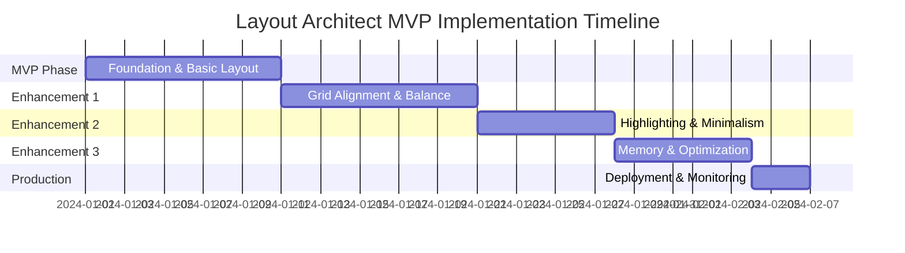

# Layout Architect Implementation Plan

## Table of Contents
1. [Executive Summary](#executive-summary)
2. [Implementation Phases - MVP Approach](#implementation-phases---mvp-approach)
3. [MVP Phase: Foundation & Basic Professional Layout](#mvp-phase-foundation--basic-professional-layout-week-1-2)
4. [Enhancement Phase 1: Grid Alignment & Balance](#enhancement-phase-1-grid-alignment--balance-week-3)
5. [Enhancement Phase 2: Highlighting & Minimalism](#enhancement-phase-2-highlighting--minimalism-week-4)
6. [Enhancement Phase 3: Memory & Optimization](#enhancement-phase-3-memory--optimization-week-5)
7. [Production Deployment](#production-deployment-week-6)
8. [Risk Mitigation](#risk-mitigation)
9. [Timeline Summary](#timeline-summary)
10. [MVP Integration Points](#mvp-integration-points)
11. [Key Benefits of MVP Approach](#key-benefits-of-mvp-approach)
12. [MVP Success Metrics](#mvp-success-metrics)
13. [Testing Strategy (Aligned with MVP Phases)](#testing-strategy-aligned-with-mvp-phases)
14. [Monitoring and Metrics](#monitoring-and-metrics)
15. [Success Criteria](#success-criteria)
16. [Conclusion](#conclusion)

## Executive Summary

This implementation plan outlines the development of the Layout Architect agent, which serves as the critical bridge between Phase 1's strategic content planning and Phase 3's content generation. The implementation will be executed in five phases over 8-10 weeks, with continuous integration into the existing Deckster infrastructure.

### Key Implementation Goals
- Build a robust layout generation system using PydanticAI
- Implement the 7-stage processing pipeline with deterministic tools
- Create seamless integration with Phase 1 and Phase 3 agents
- Establish pattern learning and memory systems
- Ensure scalability for concurrent slide processing
- Deliver progressive updates via WebSocket protocol

## Implementation Phases - MVP Approach

### Overview



### Quick Reference: What Gets Built When

| Phase | Core Features | Design Principles | Integration |
|-------|--------------|-------------------|-------------|
| **MVP** | Theme gen, Basic positioning, Integer grid | White space only | Basic message passing |
| **Enhance 1** | Validation, Consistency checks | + Grid alignment, Balance | Full Phase 1 integration |
| **Enhance 2** | Scoring, Advanced layouts | + Highlighting, Minimalism | Phase 3 guidance |
| **Enhance 3** | Pattern learning, Caching | All principles optimized | Full pipeline |

## MVP Phase: Foundation & Basic Professional Layout (Week 1-2)

### MVP Goals
Focus on delivering professional layouts with white space principle only:
- ✅ Basic theme generation (colors, typography)
- ✅ Integer-based positioning (160×90 grid)
- ✅ White space enforcement (margins, gutters, ratios)
- ✅ Simple container placement
- ✅ Basic validation
- ✅ Message passing to Director OUT

### MVP Deliverables
1. **Minimal Theme Generator**: Basic but professional themes
2. **Simple Layout Engine**: Position containers with proper spacing
3. **White Space Calculator**: Ensure 30-50% white space
4. **Basic Integration**: Receive strawman, send layouts

### 1.1 Simplified Project Structure (MVP Only)

```bash
deckster/
├── src/
│   ├── agents/
│   │   └── layout_architect/        # NEW - MVP Structure Only
│   │       ├── __init__.py
│   │       ├── agent.py             # Simple agent with basic logic
│   │       ├── models.py            # All models in one file for MVP
│   │       ├── theme_generator.py   # Basic theme generation
│   │       ├── layout_engine.py     # Simple positioning logic
│   │       └── tools/
│   │           ├── __init__.py
│   │           ├── grid_calculator.py      # Integer positioning only
│   │           └── white_space_tool.py     # White space validation
```

### 1.2 MVP Database Schema (Minimal)

Just one table for MVP - theme storage:

```sql
-- MVP: Only themes table needed initially
CREATE TABLE themes (
    id UUID PRIMARY KEY DEFAULT uuid_generate_v4(),
    session_id TEXT NOT NULL REFERENCES sessions(id),
    theme_spec JSONB NOT NULL,
    created_at TIMESTAMPTZ DEFAULT TIMEZONE('utc', NOW()),
    UNIQUE(session_id)
);
```

### 1.3 MVP Configuration (Simplified)

```python
# config/layout_architect_mvp_config.py
from pydantic import BaseModel

class LayoutArchitectMVPConfig(BaseModel):
    """Simplified MVP configuration"""
    
    # Model settings
    model_name: str = "gemini-1.5-pro"
    temperature: float = 0.7
    
    # Grid system (MVP focuses on these)
    grid_width: int = 160
    grid_height: int = 90
    margin: int = 8
    gutter: int = 4
    
    # White space only for MVP
    white_space_min: float = 0.3
    white_space_max: float = 0.5
    
    # Simple feature flags
    enable_validation: bool = True
```

### 1.4 MVP Implementation

#### Simple Agent Structure

```python
# src/agents/layout_architect/agent.py
from pydantic_ai import Agent
from pydantic_ai.models.gemini import GeminiModel
from .models import MVPTheme, MVPLayout
from .theme_generator import generate_basic_theme
from .layout_engine import LayoutEngine
from .tools.white_space_tool import calculate_white_space

class LayoutArchitectMVP:
    """MVP Layout Architect - White Space Focus"""
    
    def __init__(self, config: LayoutArchitectMVPConfig):
        self.config = config
        self.model = GeminiModel(config.model_name)
        self.layout_engine = LayoutEngine(config)
        
    async def process_strawman(self, strawman: dict) -> List[MVPLayout]:
        """Simple strawman processing"""
        # Step 1: Generate basic theme
        theme = await generate_basic_theme(strawman)
        
        # Step 2: Process each slide with white space
        layouts = []
        for slide in strawman['slides']:
            layout = await self.layout_engine.create_layout(
                slide=slide,
                theme=theme,
                enforce_white_space=True
            )
            layouts.append(layout)
            
        return layouts
```

#### MVP Models

```python
# src/agents/layout_architect/models.py
from pydantic import BaseModel
from typing import List, Dict

class MVPContainer(BaseModel):
    """Simple container with integer positions"""
    id: str
    type: str  # text, image, chart
    x: int
    y: int
    width: int
    height: int
    content: Dict

class MVPLayout(BaseModel):
    """Basic layout with containers"""
    slide_id: str
    containers: List[MVPContainer]
    white_space_ratio: float
    
class MVPTheme(BaseModel):
    """Minimal theme specification"""
    colors: Dict[str, str]  # Just primary, secondary, background
    typography: Dict[str, Dict]  # Just h1, h2, body
    margins: int = 8
    gutters: int = 4
```

#### MVP Layout Engine

```python
# src/agents/layout_architect/layout_engine.py
class LayoutEngine:
    """Simple layout engine focusing on white space"""
    
    def __init__(self, config: LayoutArchitectMVPConfig):
        self.config = config
        self.margin = config.margin
        self.gutter = config.gutter
        
    async def create_layout(
        self,
        slide: dict,
        theme: MVPTheme,
        enforce_white_space: bool = True
    ) -> MVPLayout:
        """Create simple layout with proper spacing"""
        
        # Available area after margins
        work_area = {
            'x': self.margin,
            'y': self.margin,
            'width': 160 - (2 * self.margin),
            'height': 90 - (2 * self.margin)
        }
        
        # Simple positioning for MVP
        containers = []
        current_y = work_area['y']
        
        # Title container
        if slide.get('title'):
            containers.append(MVPContainer(
                id='title',
                type='text',
                x=work_area['x'],
                y=current_y,
                width=work_area['width'],
                height=10,
                content={'text': slide['title']}
            ))
            current_y += 10 + self.gutter
        
        # Body containers (simple stacking)
        for i, point in enumerate(slide.get('content', [])):
            containers.append(MVPContainer(
                id=f'content_{i}',
                type='text',
                x=work_area['x'],
                y=current_y,
                width=work_area['width'],
                height=15,
                content={'text': point}
            ))
            current_y += 15 + self.gutter
        
        # Calculate white space
        used_area = sum(c.width * c.height for c in containers)
        total_area = 160 * 90
        white_space_ratio = (total_area - used_area) / total_area
        
        return MVPLayout(
            slide_id=slide['id'],
            containers=containers,
            white_space_ratio=white_space_ratio
```

### 1.5 MVP Testing Strategy

```python
# tests/test_layout_architect_mvp.py
import pytest
from src.agents.layout_architect.agent import LayoutArchitectMVP
from src.agents.layout_architect.models import MVPLayout

class TestLayoutArchitectMVP:
    def test_white_space_enforcement(self):
        """Test that white space ratio is maintained"""
        config = LayoutArchitectMVPConfig()
        agent = LayoutArchitectMVP(config)
        
        # Test slide with minimal content
        slide = {
            'id': 'test_1',
            'title': 'Test Slide',
            'content': ['Point 1', 'Point 2']
        }
        
        layout = await agent.layout_engine.create_layout(slide, theme)
        
        # Verify white space ratio
        assert 0.3 <= layout.white_space_ratio <= 0.5
        
    def test_integer_positioning(self):
        """Test all positions are integers"""
        # ... verify no fractional coordinates
        
    def test_margin_gutters(self):
        """Test margins and gutters are applied"""
        # ... verify 8 GU margins, 4 GU gutters
```

## Enhancement Phase 1: Grid Alignment & Balance (Week 3)

### Goals
Add precision and stability to layouts:
- ✅ Row/column alignment for similar elements
- ✅ Consistent dimensions for related content
- ✅ Visual balance calculation
- ✅ Enhanced validation

### New Components

```python
# src/agents/layout_architect/tools/alignment_validator.py
class AlignmentValidator:
    """Ensure elements align to rows/columns"""
    
    def validate_alignment(self, containers: List[MVPContainer]) -> bool:
        # Group similar containers
        # Check Y coordinates match for rows
        # Check X coordinates match for columns
        # Verify dimensions consistency
        
# src/agents/layout_architect/tools/balance_calculator.py  
class BalanceCalculator:
    """Calculate visual balance"""
    
    def calculate_balance(self, containers: List[MVPContainer]) -> float:
        # Calculate visual weights
        # Check left/right distribution
        # Return balance score
```

### Enhanced Layout Engine

```python
# Extend layout_engine.py
class EnhancedLayoutEngine(LayoutEngine):
    """Add alignment and balance to MVP"""
    
    async def create_layout(self, slide, theme, enforce_principles=True):
        # First create basic layout
        layout = await super().create_layout(slide, theme)
        
        if enforce_principles:
            # Apply alignment fixes
            layout = self.align_to_grid(layout)
            layout = self.ensure_row_column_alignment(layout)
            
            # Calculate and optimize balance
            balance_score = self.calculate_balance(layout)
            if balance_score < 0.9:
                layout = self.rebalance_layout(layout)
                
        return layout
```

## Enhancement Phase 2: Highlighting & Minimalism (Week 4)

### Goals
Add focus and clarity:
- ✅ Single focal point identification
- ✅ Accent color application
- ✅ Size/spacing emphasis
- ✅ Remove decorative elements

### New Components

```python
# src/agents/layout_architect/tools/highlight_manager.py
class HighlightManager:
    """Manage single focal point per slide"""
    
    def identify_focal_point(self, slide_content):
        # Find most important element
        # Apply accent color
        # Add isolation spacing
        # Scale size 1.2x
        
# src/agents/layout_architect/tools/minimalism_filter.py
class MinimalismFilter:
    """Remove non-functional elements"""
    
    def filter_containers(self, containers):
        # Remove purely decorative items
        # Simplify complex shapes
        # Ensure functional purpose
```

## Enhancement Phase 3: Memory & Optimization (Week 5)

### Goals
Performance and learning:
- ✅ Pattern memory implementation
- ✅ Theme caching
- ✅ Performance optimization
- ✅ Full Phase 3 integration

### New Components

```python
# src/agents/layout_architect/memory/pattern_memory.py
class PatternMemory:
    """Learn from successful layouts"""
    
    async def store_pattern(self, layout, effectiveness_score):
        # Store in database
        # Update usage counts
        
    async def retrieve_patterns(self, content_type):
        # Get relevant patterns
        # Sort by effectiveness
```

### Full Integration

```python
# Complete phase 3 guidance
class Phase3Guidance:
    """Provide layout specs to downstream agents"""
    
    def prepare_researcher_guidance(self, layout):
        # Text container capacities
        # Typography specifications
        
    def prepare_analyst_guidance(self, layout):
        # Chart dimensions
        # Color sequences
```

## Production Deployment (Week 6)

### Deployment Checklist
- [ ] All design principles score >90%
- [ ] Performance meets SLAs
- [ ] Integration tests pass
- [ ] Monitoring configured
- [ ] Documentation complete

## Risk Mitigation

### MVP Risks
1. **Too Simple**: Mitigate by ensuring white space principle is perfectly implemented
2. **Integration Issues**: Test with Phase 1 early and often
3. **Performance**: Keep initial scope small, optimize later

### Enhancement Risks
1. **Complexity Creep**: Stick to one principle per enhancement
2. **Breaking Changes**: Maintain backward compatibility
3. **Testing Gaps**: Write tests before features

## Timeline Summary

| Week | Phase | Key Deliverables | Success Criteria |
|------|-------|------------------|------------------|
| 1-2 | MVP | Basic layouts with white space | 30-50% white space ratio |
| 3 | Enhancement 1 | + Alignment & Balance | Integer positions, >90% balance |
| 4 | Enhancement 2 | + Highlighting & Minimalism | Single focus, zero decoration |
| 5 | Enhancement 3 | + Memory & Full Integration | <2s per slide, pattern learning |
| 6 | Production | Deployment & Monitoring | All principles >90% |

## MVP Integration Points

### With Phase 1 (Director IN)
```python
# Simple message handler
async def handle_strawman_approved(strawman: dict):
    layout_architect = LayoutArchitectMVP(config)
    layouts = await layout_architect.process_strawman(strawman)
    
    # Send to Director OUT
    for layout in layouts:
        await send_layout_update(layout)
```

### With Director OUT
```python
# MVP message format
{
    "type": "layout_update",
    "slide_id": "slide_001",
    "containers": [...],
    "white_space_ratio": 0.42,
    "timestamp": "2024-01-01T12:00:00Z"
}
```

## Key Benefits of MVP Approach

### 1. Quick Value Delivery
- Working layouts in 2 weeks
- Immediate feedback on core value proposition
- Early integration testing

### 2. Reduced Complexity
- Single design principle focus initially
- Simple file structure
- Minimal dependencies

### 3. Iterative Learning
- Each enhancement builds on proven foundation
- Can pivot based on real usage
- Performance optimization comes after functionality

### 4. Lower Risk
- Smaller initial scope reduces failure impact
- Each phase is independently valuable
- Can stop at any enhancement level

## MVP Success Metrics

### Week 1-2 (MVP)
- [ ] White space ratio 30-50% on all test slides
- [ ] All positions use integers
- [ ] Basic theme generation works
- [ ] Messages flow to Director OUT

### Week 3 (Enhancement 1)
- [ ] Related elements align perfectly
- [ ] Visual balance >90%
- [ ] No fractional coordinates

### Week 4 (Enhancement 2)
- [ ] Single focal point per slide
- [ ] Zero decorative elements
- [ ] Clear visual hierarchy

### Week 5 (Enhancement 3)
- [ ] <2s processing per slide
- [ ] Pattern learning functional
- [ ] Full pipeline integrated


## Testing Strategy (Aligned with MVP Phases)

### MVP Testing (Week 1-2)
- [ ] White space calculation accuracy
- [ ] Integer position validation
- [ ] Basic theme generation
- [ ] Message flow to Director OUT

### Enhancement 1 Testing (Week 3)
- [ ] Row/column alignment verification
- [ ] Dimension consistency checks
- [ ] Balance score calculation

### Enhancement 2 Testing (Week 4)
- [ ] Single focal point validation
- [ ] Minimalism compliance
- [ ] Accent color application

### Enhancement 3 Testing (Week 5)
- [ ] Performance benchmarks
- [ ] Pattern storage/retrieval
- [ ] Full integration tests

## Monitoring and Metrics

### MVP Metrics
- White space ratio per slide
- Processing time per slide
- Integer position compliance

### Enhanced Metrics (Added Progressively)
- Grid alignment accuracy
- Balance scores
- Highlighting effectiveness
- Minimalism compliance
- Pattern usage rates
- Monitoring implementation
- Progressive rollout

## Success Criteria

### Functional Success
- ✓ Processes 30 slides concurrently
- ✓ Generates themes in < 5 seconds
- ✓ Processes slides in < 2 seconds each
- ✓ All five design principles score > 90%
- ✓ Integrates seamlessly with Phase 1 and 3

### Design Quality Success
- ✓ White space ratio: 30-50% on all slides
- ✓ Grid alignment: 100% integer positions
- ✓ Row/column alignment for similar elements
- ✓ Consistent dimensions for related content
- ✓ Visual balance: > 90% score
- ✓ Highlighting: Single focus per slide
- ✓ Minimalism: Zero decorative elements

### Performance Success
- ✓ 99.9% uptime
- ✓ < 1% error rate
- ✓ > 60% cache hit rate
- ✓ Handles 100 concurrent sessions

### Quality Success
- ✓ 90% code coverage
- ✓ All design principle tests passing
- ✓ Performance SLAs met
- ✓ Professional quality validation

## Conclusion

This MVP-based implementation plan provides a practical, iterative approach to building the Layout Architect agent. By starting with white space and progressively adding design principles, we:

1. **Reduce Initial Complexity**: Focus on one principle at a time
2. **Enable Early Feedback**: Working system in 2 weeks
3. **Allow Optimization**: Can refine each principle before adding the next
4. **Minimize Risk**: Each phase delivers independent value

The structured enhancement approach ensures we build a robust system while maintaining flexibility to adjust based on real-world usage. This plan transforms the Layout Architect from a complex monolithic project into a series of manageable, valuable iterations.