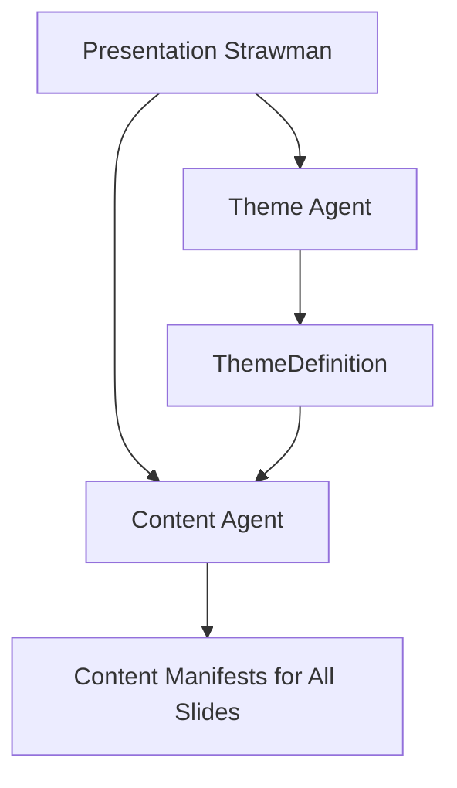
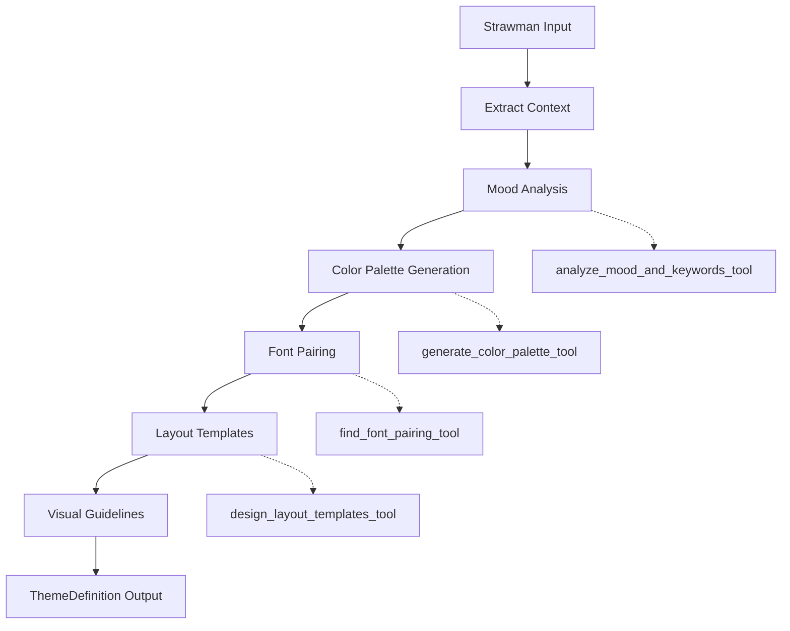
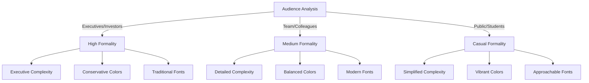
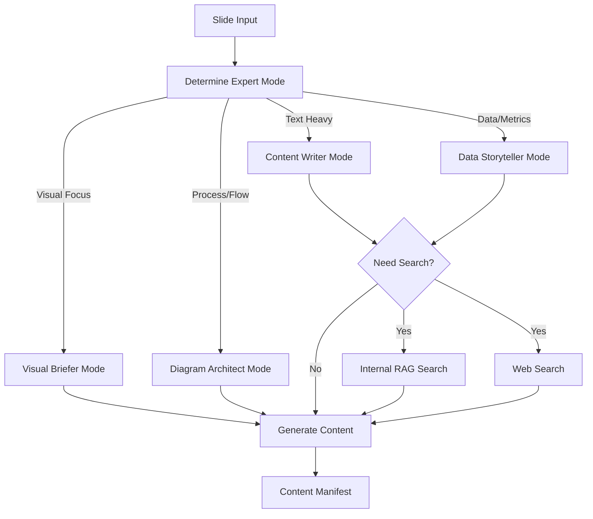
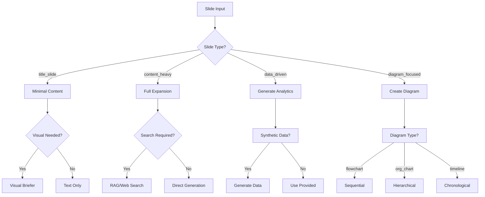
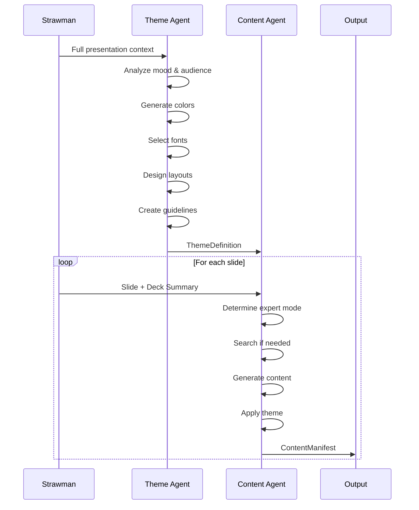

# Theme and Content Agents: Detailed Flowchart & Process Map

## Table of Contents
1. [Overview](#overview)
2. [Theme Agent Flow](#theme-agent-flow)
3. [Content Agent Flow](#content-agent-flow)
4. [Integration Flow](#integration-flow)
5. [Detailed Stage Breakdowns](#detailed-stage-breakdowns)

## Overview

This document provides a comprehensive flowchart and process map for the enhanced Theme and Content agents, showing how they transform a presentation strawman into a fully designed and content-rich presentation.



## Theme Agent Flow

### High-Level Theme Agent Process



### Detailed Theme Agent Stages

#### Stage 1: Context Extraction
```yaml
Input:
  - strawman: PresentationStrawman
    - main_title: str
    - overall_theme: str
    - design_suggestions: str
    - target_audience: str
    - slides: List[Slide]
  - session_id: str
  - brand_guidelines: Optional[Dict] (if provided)

Process:
  - Extract all unique slide types from strawman.slides
  - Parse audience for formality level
  - Identify complexity requirements

Output:
  - ThemeContext object with processed information
  - List of slide_types to generate templates for
```

#### Stage 2: Mood Analysis
```yaml
Tool: analyze_mood_and_keywords_tool

Input:
  - overall_theme: From strawman
  - design_suggestions: From strawman  
  - main_title: Presentation title
  - target_audience: Audience description

Prompt: |
  "Analyze the presentation theme and extract actionable mood keywords.
  Consider the overall theme, design suggestions, title, and target audience.
  Map to emotional tone and style direction."

Process:
  - Score mood categories (professional, modern, energetic, etc.)
  - Extract color preferences from text
  - Map audience to formality level
  - Determine emotional tone

Output:
  - mood_keywords: List[str] (e.g., ["professional", "innovative", "data-driven"])
  - primary_mood: str (e.g., "professional")
  - emotional_tone: str (e.g., "confident and trustworthy")
  - style_direction: str (e.g., "Minimalist design with clean typography")
```

#### Stage 3: Color Palette Generation
```yaml
Tool: generate_color_palette_tool

Input:
  - mood_keywords: From mood analysis
  - primary_color_hint: Extracted from design suggestions
  - industry_context: Inferred from strawman
  - accessibility_level: "AA" or "AAA"

Prompt: |
  "Generate a comprehensive color palette based on mood keywords.
  Ensure accessibility compliance and create semantic color roles."

Process:
  - Determine primary color from keywords/hints
  - Generate complementary colors based on mood
  - Check WCAG contrast ratios
  - Assign semantic roles (primary, secondary, accent, etc.)

Output:
  - colors: Dict[str, str]
    Example: {
      "primary": "#0066cc",
      "secondary": "#14b8a6",
      "accent": "#ff6b35",
      "background": "#ffffff",
      "text": "#2c3e50"
    }
  - accessibility_report: Contrast ratios and compliance
  - color_roles: Semantic descriptions for each color
```

#### Stage 4: Font Pairing
```yaml
Tool: find_font_pairing_tool

Input:
  - mood_keywords: From mood analysis
  - formality_level: "high", "medium", or "casual"
  - complexity_allowance: "executive", "detailed", or "simplified"
  - reading_context: "screen", "projection", or "print"

Prompt: |
  "Select optimal font pairing based on mood and context.
  Consider readability, formality, and visual harmony."

Process:
  - Map mood keywords to font characteristics
  - Select heading font from appropriate category
  - Select body font that pairs well
  - Create fallback stack

Output:
  - heading_font: str (e.g., "Inter")
  - body_font: str (e.g., "Open Sans")
  - fallback_stack: List[str]
  - pairing_rationale: str
  - usage_guidelines: Dict[str, str]
```

#### Stage 5: Layout Template Generation
```yaml
Tool: design_layout_templates_tool

Input:
  - slide_types: List from strawman analysis
  - mood_keywords: From mood analysis
  - formality_level: From audience analysis
  - visual_emphasis: Float (0.0-1.0)

Prompt: |
  "Design layout templates for each slide type.
  Consider content density, visual hierarchy, and white space."

Process:
  For each slide_type:
    - Calculate zone dimensions based on content needs
    - Define grid zones (title, content, visual, footer)
    - Set white space targets
    - Determine reading flow pattern

Output:
  - templates: Dict[str, LayoutTemplate]
    Each template contains:
      - zones: Dict[str, GridZone] with dimensions
      - emphasis: Which zone is primary
      - reading_flow: "F-pattern" or "Z-pattern"
```

#### Stage 6: Visual Guidelines Creation
```yaml
Internal Process (No Tool):

Input:
  - mood_keywords: From mood analysis
  - colors: From color palette
  - audience: From strawman

Process:
  - Map mood to visual styles:
    - professional → corporate-clean photography
    - innovative → abstract-tech imagery
    - educational → friendly-instructional graphics
  - Define icon style (line-art, duo-tone, filled)
  - Set data visualization approach
  - Establish illustration guidelines

Output:
  - visual_guidelines: Dict containing:
    - photography_style: str
    - iconography_style: str
    - data_viz_style: str
    - illustration_approach: str
```

### Theme Agent Decision Tree



## Content Agent Flow

### High-Level Content Agent Process



### Detailed Content Agent Stages

#### Stage 1: Content Preparation Input
```yaml
Input:
  - slide: Slide object
    - slide_id: str
    - slide_type: str
    - title: str
    - key_points: List[str]
    - narrative: str
    - visuals_needed: Optional[str]
    - analytics_needed: Optional[str]
    - diagrams_needed: Optional[str]
  - deck_summary: str (2-paragraph presentation overview)
  - theme: ThemeDefinition (from Theme Agent)
  - strawman_metadata: Dict (overall context)
  - session_id: Optional[str]

Context Building:
  - Parse slide requirements
  - Extract theme elements (mood_keywords, colors, fonts)
  - Understand slide's role in narrative
  - Identify content type needs
```

#### Stage 2: Expert Mode Selection
```yaml
Decision Logic:
  if slide_type in ["data_driven", "comparison"] 
     or "chart" in requirements or "graph" in requirements:
    → Data Storyteller Mode
  
  elif slide_type in ["diagram_focused", "process_flow"] 
       or "diagram" in requirements or "flow" in requirements:
    → Diagram Architect Mode
  
  elif visual_emphasis > 0.7 or "image" in requirements:
    → Visual Briefer Mode
  
  else:
    → Content Writer Mode (default)
```

#### Stage 3A: Content Writer Mode
```yaml
Activation: Text-heavy slides, content_heavy type

Process:
  1. Expand bullet points using theme mood keywords
  2. Adjust tone based on audience formality
  3. Structure content with proper hierarchy
  4. Apply word count limits based on slide type

Prompt Template: |
  "Transform these bullet points into presentation-ready text.
  Use mood keywords: {mood_keywords}
  Target formality: {formality_level}
  Maximum words: {word_limit}"

Output:
  - Expanded, polished text content
  - Natural integration of theme mood keywords
  - Proper heading/body hierarchy
  - Word count optimized for slide type
```

#### Stage 3B: Data Storyteller Mode
```yaml
Activation: data_driven slides, analytics needed

Process:
  1. Parse data requirements from slide narrative
  2. Generate synthetic data if no real data available
  3. Create chart specifications using theme colors
  4. Extract key insights from data
  5. Apply data visualization best practices

Special Capability: Synthetic Data Generation
  - Generates realistic data based on context
  - Ensures data tells the intended story
  - Maintains statistical plausibility

Prompt Template: |
  "Create data visualization for: {analytics_needed}
  Use theme colors: {theme_colors}
  Style: {data_viz_style}
  Include key insight that supports: {narrative}"

Output:
  - Chart type selection
  - Complete data points
  - Color mapping to theme
  - Key insight callout
  - Axis labels and formatting
```

#### Stage 3C: Visual Briefer Mode
```yaml
Activation: Slides needing imagery, visual-heavy

Process:
  1. Analyze visual requirements
  2. Create detailed image prompt (200+ words)
  3. Incorporate theme mood and style
  4. Add negative prompt for unwanted elements
  5. Specify composition and lighting

Prompt Template: |
  "Create detailed image brief for: {visuals_needed}
  Theme style: {photography_style}
  Mood keywords: {mood_keywords}
  Must align with: {narrative}"

Output:
  - Comprehensive image description
  - Style and mood specifications
  - Composition guidelines
  - Color palette integration
  - Negative prompt (what to avoid)
```

#### Stage 3D: Diagram Architect Mode
```yaml
Activation: Process flows, organizational charts, diagrams

Process:
  1. Parse diagram structure from requirements
  2. Create node hierarchy
  3. Define connections and relationships
  4. Apply theme visual style
  5. Optimize layout for clarity

Diagram Types Supported:
  - flowchart: Sequential processes
  - org_chart: Hierarchical structures
  - venn: Overlapping concepts
  - timeline: Chronological events
  - mindmap: Concept relationships

Output:
  - Node definitions with labels
  - Connection specifications
  - Visual styling using theme
  - Layout optimization
  - Reading flow guidance
```

#### Stage 4: Search Integration (Optional)
```yaml
Internal RAG Search:
  Trigger: Keywords suggest internal data needed
  Process:
    1. Generate search query from context
    2. Search internal knowledge base
    3. Extract relevant information
    4. Track source attribution
  Output:
    - Relevant data/statistics
    - Source references
    - Confidence scores

Web Search:
  Trigger: Need for current statistics/trends
  Process:
    1. Formulate search query
    2. Execute web search
    3. Parse and validate results
    4. Extract credible information
  Output:
    - Current statistics
    - Industry trends
    - Source URLs for attribution
```

#### Stage 5: Content Manifest Assembly
```yaml
Final Assembly:
  Combines all generated elements into ContentManifest

Structure:
  - slide_id: From input
  - title: Enhanced with mood keywords
  - main_points: Expanded and polished
  - supporting_text: Additional context
  - primary_visual: Main visual element
  - secondary_visuals: Supporting elements
  - data_insights: If applicable
  - layout_guidance: How to arrange content
  - theme_elements_used: Track theme integration
  - sources: All references used

Quality Checks:
  - Word count validation
  - Theme integration verification
  - Source attribution completeness
  - Visual specification detail
```

### Content Agent Decision Flowchart



## Integration Flow

### Complete System Flow



### Theme Integration Points

```yaml
Theme → Content Integration:

1. Mood Keywords:
   - Injected into all text content
   - Guide tone and voice
   - Influence word choice

2. Color Palette:
   - Applied to all charts/graphs
   - Used in diagram styling
   - Specified in visual briefs

3. Typography:
   - Heading/body font hierarchy
   - Size and spacing guidelines
   - Readability optimization

4. Visual Style:
   - Photography style for images
   - Icon style for graphics
   - Data viz approach

5. Layout Templates:
   - Zone definitions honored
   - White space targets met
   - Reading flow patterns
```

## Detailed Stage Breakdowns

### Theme Agent: Complete Process

```yaml
Stage: Theme Generation
Duration: ~10-15 seconds

Input Processing:
  1. Parse strawman (100ms)
  2. Extract slide types (50ms)
  3. Analyze audience (200ms)

Tool Execution:
  1. Mood Analysis (2-3s)
     - Keyword extraction
     - Mood mapping
     - Style direction
  
  2. Color Palette (2-3s)
     - Primary color selection
     - Palette generation
     - Accessibility checking
  
  3. Font Pairing (1-2s)
     - Font category selection
     - Pairing optimization
     - Fallback creation
  
  4. Layout Templates (3-4s)
     - Zone calculation
     - Template generation
     - White space optimization

Output Assembly:
  1. Compile ThemeDefinition (500ms)
  2. Validate completeness (200ms)
  3. Return to system (100ms)
```

### Content Agent: Per-Slide Process

```yaml
Stage: Content Generation
Duration: ~5-8 seconds per slide

Input Processing:
  1. Parse slide requirements (100ms)
  2. Extract theme elements (50ms)
  3. Determine expert mode (200ms)

Content Generation:
  1. Mode-Specific Processing (3-5s)
     - Text expansion OR
     - Data generation OR
     - Visual briefing OR
     - Diagram creation
  
  2. Search Integration (0-2s)
     - Only if needed
     - RAG or Web search
     - Source extraction
  
  3. Theme Application (1s)
     - Mood keyword injection
     - Color specification
     - Style alignment

Output Assembly:
  1. Create ContentManifest (300ms)
  2. Validate requirements (200ms)
  3. Return manifest (100ms)

Parallel Processing:
  - Can process multiple slides concurrently
  - Shared theme reduces redundancy
  - Efficient resource utilization
```

### Error Handling & Fallbacks

```yaml
Theme Agent Fallbacks:
  - If mood analysis fails → Use "professional" default
  - If color generation fails → Use safe palette
  - If font pairing fails → Use system fonts
  - If layout fails → Use standard templates

Content Agent Fallbacks:
  - If mode detection fails → Use Content Writer
  - If search fails → Continue without external data
  - If generation fails → Use simplified content
  - If theme missing → Generate without theme

Quality Assurance:
  - Each stage validates its output
  - Missing elements trigger fallbacks
  - System remains functional even with failures
  - User notified of any degradation
```

## Summary

The Theme and Content agents work in a sophisticated pipeline:

1. **Theme Agent** creates a comprehensive design system from the strawman
2. **Content Agent** uses this theme to generate consistent, high-quality content
3. Multiple expert modes ensure appropriate content for each slide type
4. Search capabilities provide relevant, current information
5. Theme integration ensures visual and tonal consistency

This architecture enables rapid, high-quality presentation generation while maintaining flexibility and extensibility for future enhancements.