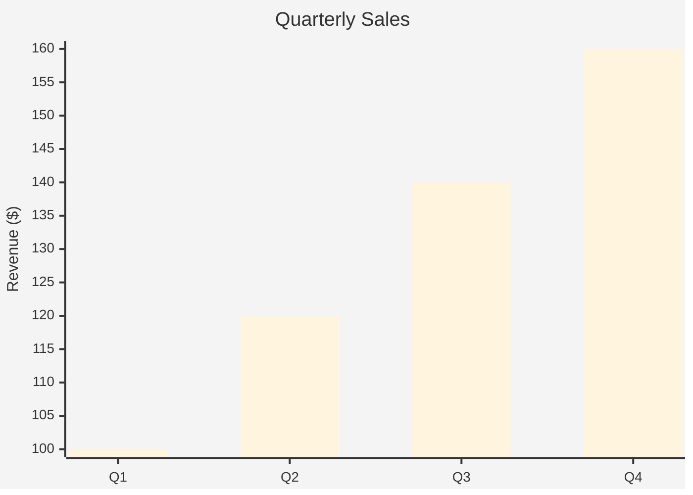

# Analytics Agent System Documentation

## Overview

The Analytics Agent is an intelligent system for generating data visualizations and charts from natural language descriptions. It follows a similar architecture to the Diagram Agent but specializes in analytical charts with synthetic data generation capabilities.

## System Architecture

### Core Components

1. **Analytics Agent (Orchestrator)**
   - Main entry point for all analytics requests
   - Coordinates the entire generation pipeline
   - Handles fallback strategies
   - Location: `src/agents/analytics_agent.py`

2. **Analytics Conductor**
   - Analyzes requests and selects optimal visualization strategy
   - Determines whether to use Mermaid or Python generation
   - Identifies data dimensions and chart types
   - Location: `src/agents/analytics_utils/conductor.py`

3. **Data Synthesizer**
   - Generates realistic synthetic data
   - Applies trends, seasonality, and noise
   - Extracts insights from generated data
   - Uses both statistical methods and LLM
   - Location: `src/agents/analytics_utils/data_synthesizer.py`

4. **Mermaid Chart Agent**
   - Generates Mermaid syntax for simple charts
   - Supports: line, bar, pie, radar charts
   - Clean, declarative syntax
   - Location: `src/agents/analytics_utils/mermaid_chart_agent.py`

5. **Python Chart Agent**
   - Handles complex visualizations via Python MCP
   - Supports: scatter, heatmap, histogram, box plot, area, bubble, waterfall, treemap
   - Uses matplotlib, seaborn, plotly
   - Location: `src/agents/analytics_utils/python_chart_agent.py`

## Generation Strategies

### Two-Method Approach

#### 1. Mermaid Generation
**When to use:**
- Simple, clean charts
- Line, bar, pie, radar charts
- Quick rendering needed
- No complex statistical features required

**Advantages:**
- Fast generation
- Clean syntax
- Easy to embed
- No external dependencies

**Example Output:**


#### 2. Python MCP Generation
**When to use:**
- Complex statistical visualizations
- Heatmaps, scatter plots, histograms
- Advanced styling needed
- Custom annotations required

**Advantages:**
- Full matplotlib/seaborn power
- Complex chart types
- Statistical features
- High customization

**Example Output:**
- Returns base64 encoded PNG/SVG
- Or Python code for execution

## Data Generation Pipeline

### Synthetic Data Creation

1. **Context Analysis**
   - Parses request for data context
   - Identifies time periods
   - Determines value ranges

2. **Base Value Generation**
   - Uses statistical distributions
   - Uniform, normal, or skewed
   - Respects min/max constraints

3. **Trend Application**
   - Increasing: Linear growth
   - Decreasing: Linear decline
   - Cyclic: Sinusoidal patterns
   - Stable: No trend

4. **Pattern Enhancement**
   - Seasonality: Periodic variations
   - Noise: Random fluctuations
   - Outliers: Occasional anomalies

5. **Insight Extraction**
   - Trend detection
   - Outlier identification
   - Peak/trough analysis
   - Statistical summaries

## Chart Type Selection Rules

### Data Dimension Mapping

```python
CHART_SELECTION_RULES = {
    DataDimension.TEMPORAL: [LINE, AREA, BAR],
    DataDimension.CATEGORICAL: [BAR, PIE, RADAR],
    DataDimension.CONTINUOUS: [HISTOGRAM, SCATTER, LINE],
    DataDimension.HIERARCHICAL: [TREEMAP, PIE],
    DataDimension.CORRELATION: [SCATTER, HEATMAP],
    DataDimension.DISTRIBUTION: [HISTOGRAM, BOX_PLOT]
}
```

### Supported Chart Types

#### Mermaid-Compatible
- **Line Chart**: Trends over time
- **Bar Chart**: Category comparisons
- **Pie Chart**: Proportions/percentages
- **Radar Chart**: Multi-dimensional comparison

#### Python-Required
- **Scatter Plot**: Correlations
- **Heatmap**: Matrix visualization
- **Histogram**: Distribution analysis
- **Box Plot**: Statistical summary
- **Area Chart**: Cumulative trends
- **Bubble Chart**: Three-variable analysis
- **Waterfall Chart**: Incremental changes
- **Treemap**: Hierarchical data

## Workflow

### Request Processing Flow

1. **Request Reception**
   ```python
   request = AnalyticsRequest(
       title="Q4 Sales Analysis",
       description="Show quarterly sales with trend",
       data_context="sales performance data",
       chart_preference=ChartType.LINE
   )
   ```

2. **Strategy Selection**
   - Conductor analyzes request
   - Identifies data dimension
   - Selects chart type
   - Determines generation method

3. **Data Synthesis**
   - Generates appropriate number of points
   - Applies requested trends
   - Creates realistic variations
   - Produces data insights

4. **Chart Generation**
   - Routes to appropriate agent
   - Generates visualization
   - Applies theme/styling
   - Validates output

5. **Output Delivery**
   ```python
   ChartOutput(
       chart_type=ChartType.LINE,
       chart_content="[Mermaid/Python code]",
       format="mermaid",
       synthetic_data=[...],
       insights=["Upward trend detected", ...],
       generation_method=GenerationMethod.MERMAID
   )
   ```

## MCP Integration Setup

### Enabling Python Chart Execution

The Analytics Agent supports multiple methods for executing Python code to generate actual chart images:

#### Method 1: VS Code Jupyter Integration (mcp__ide__executeCode)
When running in VS Code with an active Jupyter notebook:
```python
# The mcp__ide__executeCode tool executes in the notebook kernel
result = await create_analytics(
    "Create a scatter plot",
    mcp_tool=mcp__ide__executeCode
)
```
**Requirements:**
- Active Jupyter notebook in VS Code
- Python kernel with matplotlib, seaborn, numpy installed

#### Method 2: Custom MCP Server
You can provide your own MCP server for Python execution:
```python
# Using pydantic's MCP server or custom implementation
async def my_mcp_executor(code: str) -> dict:
    # Your execution logic here
    return {"output": result_string}

result = await create_analytics(
    "Create a heatmap",
    mcp_tool=my_mcp_executor
)
```

#### Method 3: Subprocess Execution (Testing)
For testing without a full MCP setup:
```python
# The test suite includes a subprocess-based executor
# See test_mcp_execution.py for implementation
```

### Automatic Detection and Fallback

The system automatically handles MCP availability:

1. **With MCP Available:**
   - Python code is executed
   - Charts are rendered using matplotlib/seaborn
   - Returns base64-encoded PNG images
   - Can be directly embedded in HTML or saved as files

2. **Without MCP (Fallback):**
   - Returns executable Python code
   - Code can be copied and run manually
   - Includes all necessary imports and setup

### Chart Generation Methods

| Chart Type | Without MCP | With MCP |
|------------|-------------|----------|
| Line, Bar, Pie, Radar | Mermaid syntax | Mermaid syntax |
| Scatter, Heatmap, Histogram | Python code | Base64 PNG image |
| Box Plot, Area, Bubble | Python code | Base64 PNG image |
| Waterfall, Treemap | Python code | Base64 PNG image |

### Testing MCP Integration

Run the MCP test suite to verify your setup:
```bash
python test/diagram-tests/analytics/test_mcp_execution.py
```

This will:
- Test basic Python execution
- Generate sample charts
- Save images to `test_output/mcp_charts/`
- Report MCP availability status

## API Usage

### Simple Usage
```python
from src.agents.analytics_agent import create_analytics

# Generate a simple bar chart
result = await create_analytics(
    "Show monthly sales for 2024",
    title="2024 Sales Performance"
)
```

### Advanced Usage
```python
# Generate specific chart type with theme
result = await create_analytics(
    "Display correlation between temperature and ice cream sales",
    title="Temperature vs Sales",
    chart_type="scatter",
    theme={"style": "seaborn", "colors": ["#FF6B6B", "#4ECDC4"]}
)
```

### With MCP Client
```python
from src.agents.analytics_agent import AnalyticsAgent
from your_mcp import MCPClient

mcp = MCPClient()
agent = AnalyticsAgent(mcp_client=mcp)

output = await agent.generate_analytics(
    "Create a complex heatmap of user activity",
    chart_preference=ChartType.HEATMAP
)
```

## Theme Configuration

### Mermaid Themes
```python
MermaidChartConfig(
    chart_type="xychart-beta",
    theme="base",  # base, dark, forest, default
    orientation="vertical",
    show_legend=True,
    color_scheme=["#3b82f6", "#10b981", "#f59e0b"]
)
```

### Python Themes
```python
PythonChartConfig(
    library="matplotlib",
    style="seaborn",  # seaborn, ggplot, bmh, fivethirtyeight
    figure_size=(10, 6),
    dpi=100,
    color_palette="husl"
)
```

## Error Handling

### Fallback Strategy
1. Primary method fails → Try fallback method
2. Both methods fail → Generate simple bar chart
3. All generation fails → Return error output

### Common Issues
- **Unsupported chart type**: Falls back to bar chart
- **MCP unavailable**: Returns Python code instead of image
- **Data synthesis failure**: Uses statistical generation
- **LLM timeout**: Uses rule-based selection

## Integration Points

### With Content Agent
```python
# Content agent requests analytics
analytics_request = {
    "content": "Revenue analysis for Q4",
    "type": "analytics",
    "chart_preference": "line"
}
```

### With Presentation System
```python
# Analytics output for slides
slide_content = {
    "type": "chart",
    "format": output.format,
    "content": output.chart_content,
    "insights": output.insights
}
```

## Testing

### Unit Tests
- Test each component independently
- Mock LLM responses
- Validate chart syntax
- Check data generation

### Integration Tests
- End-to-end generation
- Multiple chart types
- Fallback scenarios
- Theme application

### Example Test
```python
async def test_line_chart_generation():
    agent = AnalyticsAgent()
    output = await agent.generate_analytics(
        "Show monthly growth trend",
        chart_preference=ChartType.LINE
    )
    assert output.chart_type == ChartType.LINE
    assert output.format == "mermaid"
    assert len(output.synthetic_data) > 0
```

## Performance Considerations

### Optimization Tips
1. **Cache synthetic data**: Reuse for similar requests
2. **Batch LLM calls**: Combine multiple generations
3. **Precompile themes**: Store processed configurations
4. **Lazy load Python libs**: Import only when needed

### Response Times
- Mermaid generation: ~100-200ms
- Python generation: ~500-1000ms
- LLM strategy selection: ~1-2s
- Data synthesis: ~200-500ms

## Future Enhancements

### Planned Features
1. **Real data integration**: Connect to databases/APIs
2. **Interactive charts**: Plotly/D3.js support
3. **Custom themes**: User-defined color schemes
4. **Export formats**: PDF, PowerPoint, Excel
5. **Chart animations**: Animated transitions
6. **Dashboard support**: Multiple charts layout

### Extension Points
- Custom chart types via plugins
- Additional data sources
- New generation methods
- Enhanced insight algorithms

## Recent Improvements

### Data Parsing from Natural Language
The system now correctly parses specific data values from user requests:
- **Monetary values**: "Q1=$1.2M" → 1,200,000
- **Percentages**: "Company A 35%" → 35
- **Time series**: "Jan: 100k, Feb: 120k" → Correct monthly data
- **Skills/Scores**: "Communication 85" → 85

### Accurate Insight Generation
Insights are now calculated on the actual displayed data:
- Trends match the real data direction
- Peak/trough values are correctly identified
- Outliers are detected based on statistical analysis
- Insights correlate with what users see in the chart

### Full Chart Type Support
All 12+ chart types are now fully functional:
- **Mermaid charts**: Line, Bar, Pie, Radar
- **Python charts**: Scatter, Heatmap, Histogram, Box Plot, Area, Bubble, Waterfall, Treemap
- Automatic format selection based on chart complexity

### MCP Integration
- Proper integration with MCP IDE tools for Python execution
- Automatic fallback to code generation when MCP unavailable
- Base64 image generation for complex visualizations

## Summary

The Analytics Agent provides a flexible, intelligent system for generating data visualizations. By combining Mermaid's simplicity with Python's power, and adding synthetic data generation with insights, it creates meaningful visualizations from natural language requests. The two-strategy approach ensures both performance and capability, while the conductor pattern maintains extensibility for future enhancements.