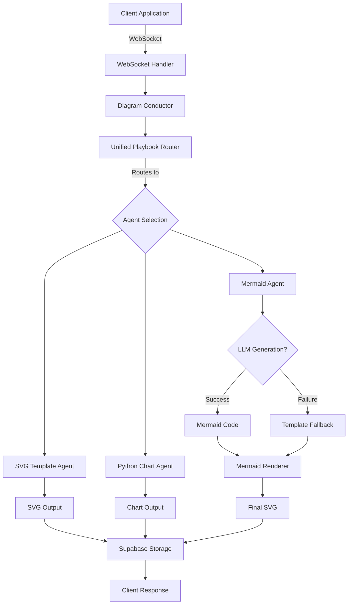
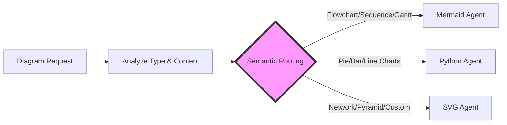
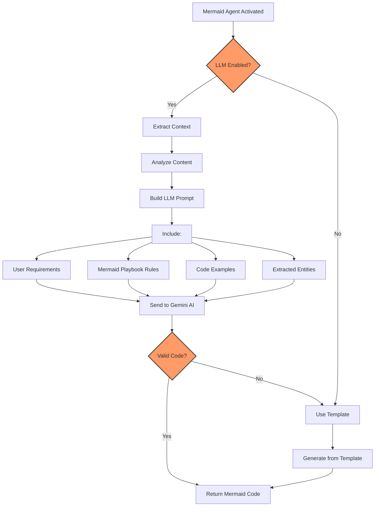
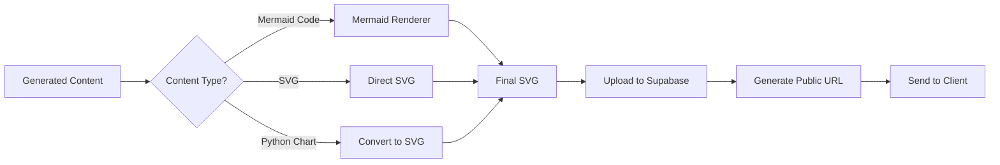
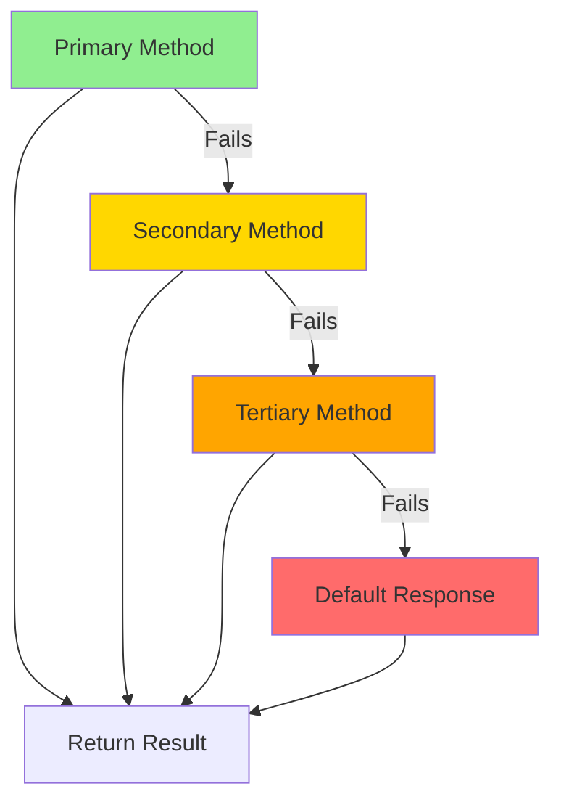

# Diagram Generation Process Documentation

## Overview

The Diagram Microservice v2 is a sophisticated WebSocket-based service that generates various types of diagrams using multiple generation strategies. It intelligently routes requests to the most appropriate generation method and provides real-time status updates throughout the process.

## Table of Contents

1. [High-Level Architecture](#high-level-architecture)
2. [The Journey of a Diagram Request](#the-journey-of-a-diagram-request)
3. [Key Components](#key-components)
4. [Generation Methods](#generation-methods)
5. [The LLM-First Approach](#the-llm-first-approach)
6. [Fallback Mechanisms](#fallback-mechanisms)
7. [Real-World Example](#real-world-example)

## High-Level Architecture

The system consists of several layers working together:



## The Journey of a Diagram Request

### Step 1: Client Connection

When a client wants to generate a diagram, they establish a WebSocket connection to the service:

```
wss://your-service.com/ws?session_id=abc123&user_id=user456
```

The connection includes:
- **Session ID**: Unique identifier for this diagram generation session
- **User ID**: Identifies the user making the request

### Step 2: Request Submission

The client sends a diagram request with the following structure:

```json
{
    "type": "diagram_request",
    "request_id": "unique-request-id",
    "data": {
        "diagram_type": "flowchart",
        "content": "User login -> Validate credentials -> Grant access",
        "theme": {
            "primaryColor": "#3B82F6",
            "secondaryColor": "#60A5FA"
        }
    }
}
```

### Step 3: Initial Processing

1. **WebSocket Handler** receives the request
2. Creates an async task for diagram generation
3. Sends immediate acknowledgment to client
4. Updates status to "thinking" 🤔

### Step 4: Intelligent Routing

The **Unified Playbook** examines the request and determines the best generation method:



The routing decision is based on:
- **Diagram type** specified in the request
- **Content analysis** using AI (if enabled)
- **Predefined rules** in the playbook
- **Template availability**

### Step 5: Agent-Specific Processing

#### If Routed to Mermaid Agent (PRIMARY: LLM Generation)



#### If Routed to Python Chart Agent

The Python agent handles data-heavy visualizations:
1. Parses numerical data from content
2. Uses matplotlib/plotly to generate charts
3. Converts to SVG format
4. Returns the visualization

#### If Routed to SVG Template Agent

The SVG agent uses pre-designed templates:
1. Selects appropriate template based on type
2. Injects user data into template placeholders
3. Applies theme colors
4. Returns customized SVG

### Step 6: Rendering and Storage

After generation, the diagram goes through final processing:



## Key Components

### 1. WebSocket Handler
- **Purpose**: Manages real-time client connections
- **Responsibilities**:
  - Connection lifecycle management
  - Message routing
  - Status updates
  - Error handling

### 2. Diagram Conductor
- **Purpose**: Orchestrates the entire generation process
- **Responsibilities**:
  - Strategy selection
  - Agent coordination
  - Fallback management
  - Cache checking

### 3. Unified Playbook
- **Purpose**: Intelligent routing engine
- **Features**:
  - AI-powered semantic routing (using Gemini)
  - Template availability checking
  - Confidence scoring for routing decisions

### 4. Generation Agents

#### Mermaid Agent
- **Primary Method**: LLM generation using Google Gemini
- **Fallback**: Template-based generation
- **Supported Types**: flowchart, sequence, gantt, state_diagram, journey_map, mind_map

#### Python Chart Agent
- **Method**: Programmatic chart generation
- **Supported Types**: pie_chart, bar_chart, line_chart, scatter_plot
- **Libraries**: matplotlib, plotly

#### SVG Template Agent
- **Method**: Pre-designed SVG templates
- **Supported Types**: pyramid, honeycomb, circular_timeline, roadmap, matrix
- **Advantage**: Pixel-perfect designs

## The LLM-First Approach

When the Mermaid Agent is selected, it follows an LLM-first strategy:

### 1. Request Analysis
The system analyzes the user's content to extract:
- **Entities**: Key components mentioned (e.g., "User", "Database", "API")
- **Relationships**: Connections between entities
- **Flow Direction**: Sequence and dependencies
- **Data Points**: Specific values or percentages

### 2. Prompt Construction
The LLM receives a comprehensive prompt including:

```
DIAGRAM TYPE: [Type specified]
USER REQUIREMENTS: [Original user content]
EXTRACTED CONTEXT:
  - Entities: [List of identified entities]
  - Relationships: [Identified connections]
  - Key Phrases: [Important terms to preserve]
SYNTAX PATTERNS: [Mermaid syntax rules for this type]
CONSTRUCTION RULES: [How to build this diagram type]
ESCAPE RULES: [Special character handling]
EXAMPLES: [Working code examples]
```

### 3. Generation and Validation
- LLM generates Mermaid code
- System validates syntax
- Checks for required elements
- Ensures code starts with correct diagram declaration

### 4. Success or Fallback
- **Success**: Use LLM-generated code
- **Failure**: Fall back to template-based generation

## Fallback Mechanisms

The system has multiple layers of fallbacks to ensure reliability:



1. **Primary**: Preferred method (e.g., LLM for Mermaid)
2. **Secondary**: Fallback method (e.g., Templates)
3. **Tertiary**: Alternative agent (e.g., SVG templates)
4. **Default**: Basic error response with explanation

## Real-World Example

Let's trace a real request through the system:

### User Request
"Create a flowchart for user authentication: User enters email and password -> System validates -> If valid, create session -> If invalid, show error"

### Step-by-Step Process

1. **Connection Established**
   - WebSocket connection opened
   - Session initialized

2. **Request Received**
   ```json
   {
     "type": "diagram_request",
     "data": {
       "diagram_type": "flowchart",
       "content": "Create a flowchart for user authentication..."
     }
   }
   ```

3. **Routing Decision**
   - Unified Playbook analyzes: "flowchart" + "authentication flow"
   - Routes to: Mermaid Agent (confidence: 95%)

4. **Mermaid Agent Processing**
   - LLM enabled? ✅ Yes
   - Extract entities: ["User", "System", "session", "error"]
   - Build LLM prompt with context

5. **LLM Generation**
   ```mermaid
   flowchart TD
       A[User enters email and password] --> B{System validates}
       B -->|Valid| C[Create session]
       B -->|Invalid| D[Show error]
   ```

6. **Validation**
   - Syntax: ✅ Valid
   - Structure: ✅ Correct
   - Content: ✅ Matches request

7. **Rendering**
   - Convert Mermaid to SVG
   - Apply theme colors

8. **Storage & Response**
   - Upload to Supabase
   - Generate public URL
   - Send response to client

### Client Receives
```json
{
  "type": "diagram_response",
  "payload": {
    "diagram_type": "flowchart",
    "url": "https://storage.supabase.co/diagrams/...",
    "metadata": {
      "generation_method": "mermaid",
      "llm_used": true,
      "response_time": 2340
    }
  }
}
```

## Status Updates

Throughout the process, the client receives real-time updates:

| Status | Message | What's Happening |
|--------|---------|------------------|
| `thinking` | "Analyzing your request..." | Routing decision being made |
| `generating` | "Creating your diagram..." | Agent is generating content |
| `rendering` | "Rendering visualization..." | Converting to final format |
| `saving` | "Saving to cloud..." | Uploading to storage |
| `complete` | "Diagram ready!" | Process complete |

## Error Handling

The system gracefully handles various error scenarios:

1. **LLM Failure**: Automatically falls back to templates
2. **Template Missing**: Routes to alternative agent
3. **Rendering Error**: Returns generated code for client-side rendering
4. **Storage Failure**: Returns inline SVG content
5. **Timeout**: Cancels operation and notifies client

## Performance Optimizations

### Caching
- Generated diagrams are cached for 1 hour
- Cache key based on: type + content hash + theme
- Instant response for repeated requests

### Parallel Processing
- Multiple requests handled concurrently
- Non-blocking async operations
- Resource pooling for expensive operations

### Smart Routing
- AI-powered routing avoids trial-and-error
- Confidence scoring prevents bad routes
- Historical success rates influence decisions

## Configuration

The system behavior can be configured through environment variables:

```bash
# Enable/Disable LLM generation
ENABLE_LLM_MERMAID=true

# LLM Model selection
GEMINI_MODEL=gemini-2.0-flash-lite

# Debug mode for detailed logs
LLM_DEBUG_MODE=false

# Temperature for creativity (0.0-1.0)
LLM_TEMPERATURE=0.7

# Request analysis
ENABLE_REQUEST_ANALYSIS=true

# Server-side rendering
MERMAID_SERVER_RENDER=true
```

## Summary

The Diagram Generation Process is designed to be:

1. **Intelligent**: Uses AI for routing and generation
2. **Reliable**: Multiple fallback layers ensure success
3. **Flexible**: Supports various diagram types and methods
4. **Fast**: Caching and optimization for quick responses
5. **User-Friendly**: Real-time updates and clear error messages

The system prioritizes LLM generation for rich, contextual diagrams while maintaining reliability through template fallbacks. This hybrid approach ensures both creativity and consistency in diagram generation.