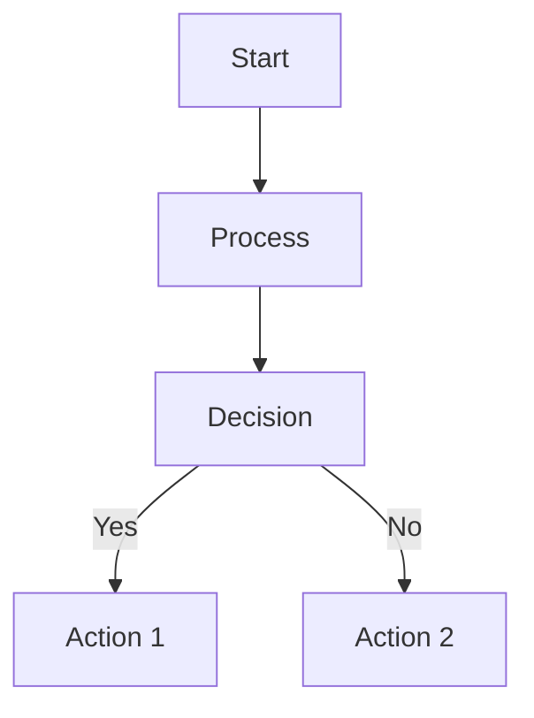

# How the Diagram Agent Works

## Overview

The Diagram Agent is a sophisticated system that automatically generates professional diagrams from structured content. It uses a two-strategy approach to create diagrams that are both visually appealing and informative, choosing the best method based on the type of diagram requested.

## System Architecture

### Core Components

1. **Main Diagram Agent** (`diagram_agent.py`)
   - The entry point and orchestrator
   - Receives diagram requests with content and specifications
   - Decides which generation strategy to use
   - Returns the final diagram output

2. **Conductor** (`conductor.py`)
   - The intelligent decision-maker
   - Analyzes the diagram type and content
   - Routes requests to either SVG or Mermaid generation
   - Handles fallback strategies if one method fails

3. **SVG Agent** (`svg_agent.py`)
   - Handles template-based diagram generation
   - Uses pre-designed SVG templates for consistent, professional output
   - Applies text wrapping, color theming, and smart positioning
   - Fast and deterministic

4. **Mermaid Agent** (`mermaid_agent.py`)
   - Generates code-based diagrams using Mermaid syntax
   - Creates flowcharts, sequence diagrams, and other complex structures
   - Flexible and adaptable to various content structures
   - Good for technical and process diagrams

5. **Models** (`models.py`)
   - Defines data structures for diagram specifications
   - Ensures type safety and validation
   - Standardizes input/output formats

## How It Works: Step by Step

### 1. Request Initiation

When a diagram is requested, the system receives:
- **Content**: The data to visualize (titles, labels, relationships)
- **Diagram Type**: What kind of diagram (pyramid, funnel, flowchart, etc.)
- **Theme**: Color scheme and styling preferences
- **Options**: Additional preferences like size, orientation

Example request structure:
```
{
  "diagram_type": "pyramid",
  "content": {
    "elements": [
      {"label": "Strategic Vision"},
      {"label": "Tactical Planning"},
      {"label": "Operational Excellence"}
    ],
    "title": "Organizational Hierarchy"
  },
  "theme": {
    "colors": {
      "primary": "#3b82f6",
      "secondary": "#10b981"
    }
  }
}
```

### 2. Strategy Selection

The Conductor analyzes the request and decides:

**Uses SVG Templates when:**
- Diagram type has a matching template (pyramid, funnel, SWOT, etc.)
- Consistency and professional appearance are priorities
- Fast generation is needed
- Content fits well into predefined structures

**Uses Mermaid when:**
- Diagram needs dynamic structure (flowcharts, sequences)
- Content has complex relationships
- No suitable SVG template exists
- Technical diagrams are requested

### 3. SVG Template Generation Process

When SVG is chosen, the process is:

#### a. Template Selection
The system matches the diagram type to one of 10 available templates:
- pyramid_3_level.svg - Hierarchical structures
- funnel_5_stage.svg - Sales/conversion processes
- matrix_2x2.svg - Decision matrices
- timeline_horizontal.svg - Chronological events
- cycle_4_step.svg - Circular processes
- venn_2_circle.svg - Set relationships
- hub_spoke_6.svg - Central concept with satellites
- honeycomb_7.svg - Interconnected concepts
- swot_matrix.svg - SWOT analysis
- process_flow_5.svg - Sequential processes

#### b. Content Extraction
The agent extracts relevant text from the content:
- Identifies labels for each template position
- Maps content elements to template placeholders
- Handles missing or extra content gracefully

#### c. Text Processing
Smart text handling includes:
- **Character counting**: Calculates how many characters fit in each area
- **Word wrapping**: Splits long text into multiple lines
- **Truncation**: Adds "..." when text exceeds maximum lines
- **Line limits**: Usually 2 lines for most elements, 4 for SWOT

Example: "Strategic Vision and Leadership Excellence" becomes:
```
Line 1: "Strategic Vision and"
Line 2: "Leadership Excellence"
```

#### d. Color Application
The theming system:
- Extracts colors from the theme specification
- Applies background colors to shapes
- Calculates text color contrast (white on dark, black on light)
- Ensures readability with luminance calculations

For pyramid specifically:
- Level 1 (top): Light amber (#fef3c7)
- Level 2 (middle): Light green (#d1fae5)
- Level 3 (bottom): Light blue (#dbeafe)
- All text: Black (#1e293b) for consistency

#### e. SVG Manipulation
Using XML parsing (ElementTree):
1. Loads the template SVG file
2. Finds elements by their ID attributes
3. Replaces text content in text elements
4. Updates fill colors in shape elements
5. Adds `<tspan>` elements for multi-line text
6. Adjusts positioning for wrapped text

#### f. Output Generation
Returns a complete SVG with:
- All text properly positioned and wrapped
- Colors applied according to theme
- Proper XML structure and namespaces
- Validation to ensure well-formed output

### 4. Mermaid Generation Process

When Mermaid is chosen:

#### a. Syntax Building
Constructs Mermaid code based on diagram type:


#### b. Content Mapping
- Converts content elements to Mermaid nodes
- Establishes relationships as edges
- Applies styling directives

#### c. Theme Integration
- Adds Mermaid theme configurations
- Sets colors using CSS-like syntax
- Defines node shapes and styles

### 5. Special Features

#### Text Wrapping Algorithm
```python
def wrap_text(text, max_width_chars, max_lines):
    1. Split text into words
    2. Build lines by adding words until width exceeded
    3. If exceeding max_lines, truncate with "..."
    4. Return list of lines
```

#### Color Contrast Calculation
```python
def get_text_color_for_background(bg_color):
    1. Convert hex color to RGB
    2. Calculate luminance: (0.299*R + 0.587*G + 0.114*B)/255
    3. If luminance < 0.5: use white text
    4. Else: use dark text
```

#### Responsive Sizing
- Pyramid template: 1000x750px (25% larger than original)
- Maintains aspect ratios and proportions
- Font sizes scale with diagram size

## Content Processing

### Input Normalization
The system handles various content formats:

**Simple list:**
```python
["Item 1", "Item 2", "Item 3"]
```

**Structured elements:**
```python
{
  "core_elements": [
    {"label": "Item 1", "value": 100},
    {"label": "Item 2", "value": 75}
  ]
}
```

**With relationships:**
```python
{
  "elements": [...],
  "relationships": [
    {"from": "A", "to": "B", "label": "connects"}
  ]
}
```

### Smart Content Mapping

For SWOT matrices, comma-separated items become separate lines:
- Input: "Strong brand, Skilled workforce, Market leader"
- Output: Three separate lines in the strengths quadrant

For pyramids, hierarchy is preserved:
- Top level: Most strategic/important
- Middle level: Tactical elements
- Bottom level: Operational/foundational

## Error Handling and Fallbacks

### Graceful Degradation
1. If SVG template fails → Try Mermaid
2. If Mermaid fails → Return error with helpful message
3. If content doesn't fit → Truncate with ellipsis
4. If colors invalid → Use defaults

### Validation
- Checks SVG is well-formed XML
- Validates Mermaid syntax
- Ensures all required fields present
- Verifies color formats

## Performance Characteristics

### SVG Templates
- **Speed**: Very fast (< 100ms)
- **Consistency**: 100% deterministic
- **Quality**: Professional, polished
- **Flexibility**: Limited to template structure

### Mermaid
- **Speed**: Fast (< 200ms)
- **Consistency**: High but not absolute
- **Quality**: Clean, technical
- **Flexibility**: Very flexible

## Recent Improvements

### Pyramid Enhancements
- Proportionally scaled 25% larger
- Light background colors for readability
- Consistent black text
- Improved text wrapping

### SWOT Matrix Updates
- Much lighter backgrounds
- Multi-line item support
- Up to 4 lines per quadrant
- Better text contrast

### General Improvements
- Smart text truncation with ellipsis
- Automatic color contrast calculation
- Consistent theming across templates
- Better namespace handling in SVG

## File Structure

```
diagram_utils/
├── diagram_agent.py      # Main orchestrator
├── conductor.py          # Strategy selector
├── svg_agent.py         # SVG template handler
├── mermaid_agent.py     # Mermaid generator
├── models.py            # Data structures
├── templates/           # SVG template files
│   ├── pyramid_3_level.svg
│   ├── funnel_5_stage.svg
│   └── ... (8 more templates)
└── diagrams_read_me.md  # This file
```

## Usage Example

```python
# Create diagram specification
spec = DiagramSpec(
    diagram_type="pyramid",
    content={
        "elements": [
            {"label": "Vision"},
            {"label": "Strategy"},
            {"label": "Execution"}
        ],
        "title": "Business Framework"
    },
    theme={"colors": {"primary": "#3b82f6"}}
)

# Generate diagram
agent = DiagramAgent()
result = await agent.generate_diagram(spec)

# Output includes:
# - SVG content as string
# - Metadata about generation
# - Any warnings or notes
```

## Key Design Principles

1. **Separation of Concerns**: Each component has a single responsibility
2. **Flexibility**: Multiple strategies for different needs
3. **Fail-Safe**: Fallback mechanisms ensure reliability
4. **User-Friendly**: Handles various input formats gracefully
5. **Performance**: Optimized for speed without sacrificing quality
6. **Maintainability**: Clean code structure, well-documented
7. **Extensibility**: Easy to add new templates or strategies

## Future Enhancements Possible

- Additional SVG templates
- Advanced Mermaid diagram types
- Animation support
- Interactive elements
- Export to multiple formats (PNG, PDF)
- Custom template creation
- AI-powered layout optimization
- Real-time collaboration features

## Conclusion

The Diagram Agent is a robust, intelligent system that transforms structured content into professional visualizations. By combining the consistency of templates with the flexibility of code generation, it provides the best of both worlds for diagram creation. The system's modular architecture ensures it can evolve and adapt to new requirements while maintaining reliability and performance.